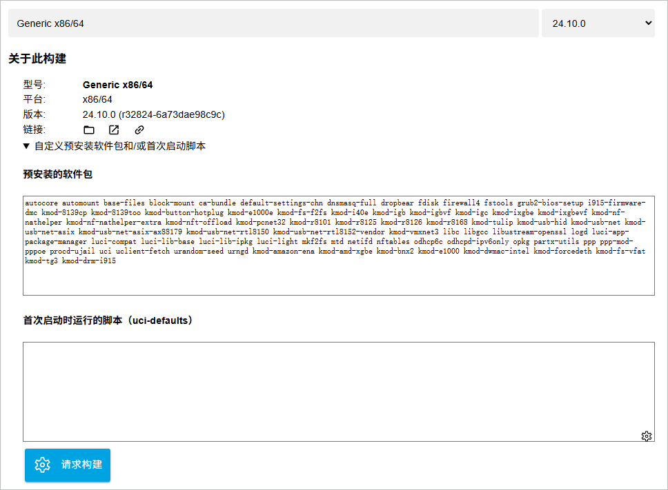

## 内核级高性能透明代理工具 Dae(大鹅) 安装及配置指南

## 什么是Dae

**Dae**（大鹅）是一个高性能的透明代理解决方案（科学上网解决方案），在作用上与Mihomo、Singbox等基本相同，均是通过域名、IP、端口、来源地址、目标地址以及规则集等等不同方式，对流量进行分流以及使用代理，从而达到科学上网的目的。

但在核心原理上，Dae通过在Linux内核中使用eBPF实现流量分流拆分与透明代理，允许在网络驱动程序的最早阶段处理数据包。这样可以在将数据包传递给内核协议栈之前进行快速处理，比如丢弃、转发或修改数据包，所以相比其他软件，Dae的直连性能更好，同时也更方便实现国内外流量分流，在效率上更优。

| 项目    | 版本号(Latest)           | 更新日期                                 | 项目地址                                     |
| ------- | ------------------------ | ---------------------------------------- | -------------------------------------------- |
| **dae** |  |  | [GitHub](https://github.com/daeuniverse/dae) |

### Dae支持功能

- 支持通过本地主机的进程名称进行流量分流。
- 支持通过局域网中的MAC地址进行流量分流。
- 支持使用反向匹配规则进行流量分流。
- 支持根据策略自动切换节点。
- 支持 Shadowsocks、Trojan(-go) 和Socks5的全锥NAT（Full Cone）
- 支持高级DNS解析策略及域名分流
- 天然支持IPv6，无需额外设置

### Dae支持功能

- HTTP(S), naiveproxy
- Socks
- VMess(AEAD, alterID=0) / VLESS
- Shadowsocks
- ShadowsocksR
- Trojan
- Tuic (v5)
- Juicity
- Hysteria2
- Proxy chain (flexible protocol)链式代理

### Dae支持系统

由于Dae软件自身特性（使用eBPF），只支持Linux核心的操作系统（Only Support By Linux Kernel），并且内核版本不低于`5.17` ，如果使用`0.9.0-rc`以上，内核版本不低于`6.1.0`。Dae需要Linux Kernel内核开启如下选项，一般来说，完整的Linux系统都是已经处于开启状态：

```
CONFIG_BPF=y
CONFIG_BPF_SYSCALL=y
CONFIG_BPF_JIT=y
CONFIG_CGROUPS=y
CONFIG_KPROBES=y
CONFIG_NET_INGRESS=y
CONFIG_NET_EGRESS=y
CONFIG_NET_SCH_INGRESS=m
CONFIG_NET_CLS_BPF=m
CONFIG_NET_CLS_ACT=y
CONFIG_BPF_STREAM_PARSER=y
CONFIG_DEBUG_INFO=y
# CONFIG_DEBUG_INFO_REDUCED is not set
CONFIG_DEBUG_INFO_BTF=y
CONFIG_KPROBE_EVENTS=y
CONFIG_BPF_EVENTS=y
```

可以通过如下命令查看Linux内核是否开启了这些选项：

```
zcat /proc/config.gz || cat /boot/{config,config-$(uname -r)}
```

所以Dae这个软件更适合部署于X86架构的路由器或者旁路由（旁路网关）上作为代理网关进行科学上网来使用，嵌入式设备或者硬路由由于Linux核心版本问题，大部分无法正常使用。常规的Linux发行版均可满足Dae的要求，例如Debian（我目前在使用的）、 Ubuntu、 Arch Linux、Fedora等等。Dae也支持在OpenWRT上进行使用，但需要自行进行固件编译，使用较新的Linux Kernel版本，并开启对应内核选项，默认版本大部分内核暂时不满足Dae的需求。

我个人建议作为科学上网的旁路网关（或者说是旁路由，但是其实并没有使用到路由的功能），还是尽量使用完整版的Linux发行版，现在Youtube上不少UP主也开始推荐主路由器 + Linux发行版作为旁路网关的家庭网络科学上网方案，一方面因为在旁路网关中，OpenWRT提供的很多功能用不到，另外一方面，在Linux Kernel的更新以及完整性上，OpenWRT也阉割了很多，Kernel特性支持较为落后，目前OpenWRT的主力版本还在使用5.15的Kernel，这也是为了兼容各种嵌入式设备与多平台架构的结果。

## Dae安装

本篇内容是以我个人网络环境和拓扑为操作前提进行编写，所以在特殊场景下，可能并不适用于你的网络环境。我所使用的整体系统环境如下：

- Proxmox VE（PVE）环境，未进行网卡直通
- Debian 12 （核心版本：6.1.0-26-amd64）
- 作为旁路由（旁路网关）使用，只有一个网口ens18

### Dae安装脚本

#### Linux衍生版本安装Dae

衍生版本包括Debian、Ubuntu、Kali、Fedora、Arch等等。

Dae提供了脚本直接进行安装，可通过如下命令进行：

```
sudo sh -c "$(wget -qO- https://cdn.jsdelivr.net/gh/daeuniverse/dae-installer/installer.sh)" @ install use-cdn
```

当前Release版本为0.9，最新RC版本为1.0rc2，如果希望使用rc版本，可使用如下命令：

```
sudo sh -c "$(wget -qO- https://cdn.jsdelivr.net/gh/daeuniverse/dae-installer/installer.sh)" @ install-prerelease use-cdn
```

如果需要卸载Dae，可使用如下命令：

```
sudo sh -c "$(curl -sL https://raw.githubusercontent.com/daeuniverse/dae-installer/main/uninstaller.sh)"
```

安装完成后，二进制执行文件位于`/usr/local/bin/dae` ，同时会自动添加systemctl执行脚本；

配置文件位于`/usr/local/etc/dae/config.dae`

这个方法不适用与OpenWRT用户。如果你是OpenWRT用户，请参考下面部分。

#### OpenWRT通过OPKG安装Dae

如果你是ImmortalWRT `24.10`版本用户（Linux内核版本`6.6.73`），通过ImmortalWRT的官方软件源通过opkg即可安装，同时需要安装的kmod依赖也在下面的命令里面。目前提供的版本为`0.9.0-r2`：

```
opkg update
opkg install kmod-nft-bridge kmod-veth kmod-sched-core kmod-sched-bpf kmod-xdp-sockets-diag kmod-sched-bpf kmod-sched-core kmod-xdp-sockets-diag dae dae-geoip dae-geosite
```

以上方法也同样适用于Daed。

#### OpenWRT通过OPKG安装Dae

如果使用的是官方版本的OpenWRT（官方版本可能无法直接安装kmod的ipk文件），在编译时没有选择所需的kmod依赖，而是使用的默认packages，那么可能需要重新编译安装，推荐直接使用ImmortalWRT，具体流程如下：

**1.**打开[ImmortalWrt Firmware Selector](https://firmware-selector.immortalwrt.org/)并选择你的机器架构，软路由一般为Generic x86/64



**2.**点击 “自定义预安装软件包和/或首次启动脚本” 进行定制ImmortalWRT，并在 “预安装的软件包” 中复制粘贴如下内容：

```
autocore automount base-files block-mount ca-bundle default-settings-chn dnsmasq-full dropbear fdisk firewall4 fstools grub2-bios-setup i915-firmware-dmc kmod-8139cp kmod-8139too kmod-button-hotplug kmod-e1000e kmod-fs-f2fs kmod-i40e kmod-igb kmod-igbvf kmod-igc kmod-ixgbe kmod-ixgbevf kmod-nf-nathelper kmod-nf-nathelper-extra kmod-nft-offload kmod-pcnet32 kmod-r8101 kmod-r8125 kmod-r8126 kmod-r8168 kmod-tulip kmod-usb-hid kmod-usb-net kmod-usb-net-asix kmod-usb-net-asix-ax88179 kmod-usb-net-rtl8150 kmod-usb-net-rtl8152-vendor kmod-vmxnet3 libc libgcc libustream-openssl logd luci-app-package-manager luci-compat luci-lib-base luci-lib-ipkg luci-light mkf2fs mtd netifd nftables odhcp6c odhcpd-ipv6only opkg partx-utils ppp ppp-mod-pppoe procd-ujail uci uclient-fetch urandom-seed urngd kmod-amazon-ena kmod-amd-xgbe kmod-bnx2 kmod-e1000 kmod-dwmac-intel kmod-forcedeth kmod-fs-vfat kmod-tg3 kmod-drm-i915 kmod-nft-bridge kmod-veth kmod-sched-core kmod-sched-bpf kmod-xdp-sockets-diag kmod-sched-bpf kmod-sched-core kmod-xdp-sockets-diag dae dae-geoip dae-geosite
```

**3.**点击“请求构建”，进行定制版ImmortalWRT定制版编译请求，然后等待编译完成并生成下载链接,这个过程大概5-10分钟。

**4.**编译完成后“自定义下载”里会显示不同版本的下载按钮，一般选择“COMBINED-EFI (EXT4)” ，下载后的镜像为`*.img` 格式，根据自己的虚拟化系统不同，进行格式转换。之后的流程与其他在软路由上安装OpenWRT的流程相同。

5.单独的Dae安装文件（dae_0.9.0-r2_x86_64.ipk）下载地址为：
https://downloads.immortalwrt.org/releases/24.10.0/packages/x86_64/packages/dae_0.9.0-r2_x86_64.ipk

以上方法也同样适用于Daed。

### 更新GeoIP与GeoSite数据库

如果需要更新[GeoIP](https://github.com/Loyalsoldier/geoip)与[Geosite](https://github.com/Loyalsoldier/v2ray-rules-dat)数据库，那么可以使用如下命令：

**更新GEOIP**

```
sudo sh -c "$(wget -qO- https://cdn.jsdelivr.net/gh/daeuniverse/dae-installer/installer.sh)" @ update-geoip use-cdn
```

**更新GEOSITE**

```
sudo sh -c "$(wget -qO- https://cdn.jsdelivr.net/gh/daeuniverse/dae-installer/installer.sh)" @ update-geosite use-cdn
```

更新后的GeoIP与GeoSite文件位于`/usr/local/share/dae` 文件夹内，Dae会自动使用该位置的GeoIP与GeoSite数据库文件，无需进行移动或复制至新的位置。

## Dae配置文件

Dae的配置文件很简单，而且可读性也很高，不必考虑乱七八糟的防火墙劫持与DNS劫持，在我的网络环境下，对付ISP的劫持反诈的劫持也有很好的效果。

以我个人网络环境为例，提供Dae配置文件如下，需要修改的部分为`global`部分`lan_interface`的网卡名称、`subscription` 内的订阅地址，`group`部分的节点过滤规则。这套配置目前使用于旁路网关上，支持IPv6，同时[ipleak](https://ipleak.net/)超过300次检测未发现DNS泄露情况。

**2025.12.7更新：**

- 增加了小米部分设备域名。部分反应miwifi.com 域名请求次数太多可能是导致内存泄露的原因。

```
global {
    log_level: warn
    tproxy_port: 12345
    allow_insecure: false
    check_interval: 30s
    check_tolerance: 50ms
    lan_interface: 网卡名称
    wan_interface: auto
    udp_check_dns:'dns.google.com:53,8.8.8.8,2001:4860:4860::8888'
    tcp_check_url: 'http://cp.cloudflare.com,1.1.1.1,2606:4700:4700::1111'
    dial_mode: domain
    tcp_check_http_method: HEAD
    disable_waiting_network: true
    auto_config_kernel_parameter: true
    sniffing_timeout: 100ms
    tls_implementation: tls
    utls_imitate: chrome_auto
    tproxy_port_protect: true
    so_mark_from_dae: 0
}

subscription {
    my_sub: '你的订阅地址'
}

dns {
  upstream {
    googledns: 'tcp+udp://dns.google:53'
    alidns: 'udp://dns.alidns.com:53'
  }
  routing {
    # 根据 DNS 查询，决定使用哪个 DNS 上游。
    # 按由上到下的顺序匹配。
    request {
      # 对于中国大陆域名使用 alidns，其他使用 googledns 查询。
      qname(geosite:cn) -> alidns
      # fallback 意为 default。
      fallback: googledns
    }
  }
}

group {
    proxy {
        policy: min_moving_avg
        filter: subtag(my_sub) && name(keyword: '香港家宽')
    }

    sg {
        policy: min_moving_avg
        filter: subtag(my_sub) && name(keyword: '新加坡家宽')
    }
}

routing {
    pname(NetworkManager) -> direct
    dip(224.0.0.0/3, 'ff00::/8') -> direct
    dscp(4) -> direct

    dip(geoip:private) -> direct
    
    ### OpenAI
    domain(geosite:openai) -> proxy

    ### AppleCN
    domain(geosite:apple@cn) -> direct

    ### SteamCN
    domain(geosite:steam@cn) -> direct

    ### telegram
    dip(geoip:telegram) -> proxy

    ### WX DOMAIN
    domain(geosite:tencent) -> direct

    ### Github
    domain(geosite:github) -> proxy

    ### Docker
    domain(geosite:docker) -> proxy

    ### DIRECT MACHINE
    # mac("BC:24:11:XX:XX:XX") -> direct
    
    ### Game
    domain(geosite: category-games@cn) -> direct

    ### Write your rules below.
    ### 如果使用小米路由器，配置放行，避免内存泄露
    domain(suffix: miwifi.com) -> direct(must)
    ### 小米系统更新CDN
    domain(suffix: cdn.pandora.xiaomi.com) -> direct(must)
    ### 小米电视
    domain(suffix: tv.global.mi.com) -> direct(must)

    ### 禁用Quic，避免CPU高负载及内存泄露
    l4proto(udp) && dport(443) -> block
    domain(geosite:geolocation-!cn) -> proxy
    dip(geoip:cn) -> direct
    domain(geosite:china-list) -> direct
    domain(geosite:cn) -> direct

    fallback: proxy
}
```

**需要注意部分：**

- `Group` 内节点组名称需要与 `Routing` 中规则名称对应，例如修改了节点组 `Proxy` 的名称，那么在 `Routing` 中也需要修改 `proxy` 为新的名称

- 如果使用RC版本，DNS可以使用DOH或DOT，支持H3协议的DOH，以阿里巴巴的阿里云DNS举例：

  - DOH：`h3://dns.alidns.com:443`
  - DOT：`tls://dns.alidns.com:853`
  - DOQ：`quic://dns.alidns.com:853`

- 节点过滤规则：如果使用固定节点，`policy: fixed(0)` 并且`filter: name(节点名称) `，如果节点名称中包括emoji符号，可能无法正常选择提示报错，此时建议使用`filter: name(keyword: ‘节点关键字’)` 方式进行过滤选择。

- `Routing` 中的规则为顺序匹配，从上至下，所以建议将特定规则放在最上方，将例如`Geosite:CN` 等较大的规则集放在下方，避免规则冲突无法正常匹配。例如，你可以将自定义规则放置于最上方。

  

### 启动Dae

使用如下命令可以启动Dae。

```
systemctl start Dae
```

在OpenWRT软路由中，启动命令为：

```
/etc/init.d/dae start
```

如果需要在前台使用Dae，便于查看Dae运行情况，可以使用：

```
/usr/local/bin/dae run --disable-timestamp -c /usr/local/etc/dae/config.dae
```

在OpenWRT系统中则为如下命令：

```
dae run --disable-timestamp -c /etc/dae/config.dae
```

当修改配置文件后，需要重载Dae配置文件时，可以使用：

```
/usr/local/bin/dae reload
```

在OpenWRT中则为如下命令

```
/etc/init.d/dae reload
```

### Dae自动更新并存储订阅

由于Dae每次启动时均需要重新读取订阅信息，本身并不存取订阅信息，当订阅链接被墙或者无法访问时，就无法正常获取到订阅信息及分组信息，造成访问异常。以下方法可以实现订阅信息存储和自动订阅更新。

#### [systemd.timer](https://www.freedesktop.org/software/systemd/man/latest/systemd.timer.html)方法

假设你的dae配置文件存储于`/usr/local/etc/dae/` ，这也是通过自动安装脚本默认的存储位置。那么新建一个`/usr/local/bin/update-dae-subs.sh`文件:

```
#!/bin/bash

# Change the path to suit your needs
cd /usr/local/etc/dae || exit 1
version="$(dae --version | head -n 1 | sed 's/dae version //')"
UA="dae/${version} (like v2rayA/1.0 WebRequestHelper) (like v2rayN/1.0 WebRequestHelper)"
fail=false

while IFS=':' read -r name url
do
        curl --retry 3 --retry-delay 5 -fL -A "$UA" "$url" -o "${name}.sub.new"
        if [[ $? -eq 0 ]]; then
                mv "${name}.sub.new" "${name}.sub"
                chmod 0600 "${name}.sub"
                echo "Downloaded $name"
        else
                if [ -f "${name}.sub.new" ]; then
                        rm "${name}.sub.new"
                fi
                fail=true
                echo "Failed to download $name"
        fi
done < sublist

dae reload

if $fail; then
        echo "Failed to update some subs"
        exit 2
fi
```

赋予这个文件可执行权限：

```
chmod +x /usr/local/bin/update-dae-subs.sh
```

配置`systemd.timer`和`systemd.service`进行自动更新

- `/etc/systemd/system/update-subs.timer`: 以下代码是每12小时，或者每次系统启动后15分钟更新

```
[Unit]
Description=Auto-update dae subscriptions

[Timer]
OnBootSec=15min
OnUnitActiveSec=12h

[Install]
WantedBy=timers.target
```

- `/etc/systemd/system/update-subs.service`:

```
[Unit]
Description=Update dae subscriptions
Wants=network-online.target
After=network-online.target

[Service]
Type=oneshot
ExecStart=/usr/local/bin/update-dae-subs.sh
Restart=on-failure
```

新建订阅链接文件：`/usr/local/etc/dae/sublist` ，并安装以下模板填写订阅链接，如果只有一个订阅，则保留并填写一个即可。当通过`update-subs.timer` 拉取订阅信息时，会自动建立`sub1`、`sub2`、`sub3` 的订阅文件。

```
sub1:https://mysub1.com
sub2:https://mysub2.com
sub3:https://mysub3.com
```

赋予订阅链接文件`600`权限

```
chmod 0600 /usr/local/etc/dae/sublist
```

修改`config.dae` 中`subscription` 部分内容为订阅文件

```
subscription {
    # Add your subscription links here.
    sub1:'file://sub1.sub'
    sub2:'file://sub2.sub'
    sub3:'file://sub3.sub'
}
```

启动Timer

```
systemctl enable --now update-dae-subs.timer

# If you need to renew your subscription immediately or haven't pulled a subscription before
systemctl start update-dae-subs.service
```

#### Crontab方法

如果你的系统没有`system.timer` ，也可以使用crontab进行替代。区别在于无法实现系统启动后自定义时间进行更新，只能定时更新。

编写`/usr/local/bin/update-dae-subs.sh 文件`

```
#!/bin/bash

# Change the path to suit your needs
cd /usr/local/etc/dae || exit 1
version="$(dae --version | head -n 1 | sed 's/dae version //')"
UA="dae/${version} (like v2rayA/1.0 WebRequestHelper) (like v2rayN/1.0 WebRequestHelper)"
fail=false

while IFS=':' read -r name url
do
        curl --retry 3 --retry-delay 5 -fL -A "$UA" "$url" -o "${name}.sub.new"
        if [[ $? -eq 0 ]]; then
                mv "${name}.sub.new" "${name}.sub"
                chmod 0600 "${name}.sub"
                echo "Downloaded $name"
        else
                if [ -f "${name}.sub.new" ]; then
                        rm "${name}.sub.new"
                fi
                fail=true
                echo "Failed to download $name"
        fi
done < sublist

dae reload

if $fail; then
        echo "Failed to update some subs"
        exit 2
fi
```

通过crontab实现定时更新，以下例子为12小时执行一次。你可以使用[crontab计算器](https://crontab.online/zh/)查询定时规则。

```
0 */12 * * * bash /usr/local/bin/update-dae-subs.sh
```

剩余步骤与上面`system.timer`部分相同。

如果需要图形界面进行配置，可以选择[Daed](https://github.com/daeuniverse/daed)，配置文件内容大同小异，主要就是DNS和Routing部分，对应截取之后粘贴到控制台里面就好。

## OpenAI相关规则

`geosite:openai` 规则并不全面，如果遇到无法使用的情况或者降智情况，可以添加以下部分规则，替换ai 代理组为你的代理组名称：

```
domain(geosite:category-ai-chat-!cn) -> ai

domain(
    suffix: copilot.microsoft.com,
    suffix: gateway-copilot.bingviz.microsoftapp.net,
    suffix: mobile.events.data.microsoft.com,
    suffix: graph.microsoft.com,
    suffix: analytics.adjust.com,
    suffix: analytics.adjust.net.in,
    suffix: api.revenuecat.com,
    suffix: t-msedge.net,
    suffix: cloudapp.azure.com,
    suffix: browser-intake-datadoghq.com,
    suffix: in.appcenter.ms,
    suffix: guzzoni.apple.com,
    suffix: smoot.apple.com,
    suffix: apple-relay.cloudflare.com,
    suffix: apple-relay.fastly-edge.com,
    suffix: cp4.cloudflare.com,
    suffix: apple-relay.apple.com,
    suffix: anthropic.com,
    suffix: claude.ai,
    suffix: cdn.usefathom.com,
    suffix: claudeusercontent.com
) -> ai
```

以上规则包括**Gemini**，**Openai**，**Copilot**，**Apple Intelligence**, **Claude**这些AI服务提供商。

## 关于Dae的CPU占用率高及内存泄露

建议添加如下规则禁止Quic。Daed也建议添加该规则。

```
l4proto(udp) && dport(443) -> block
```

同时建议添加机场节点域名至Direct规则内，避免回环产生的内存泄露。