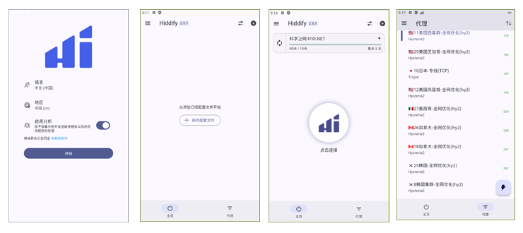
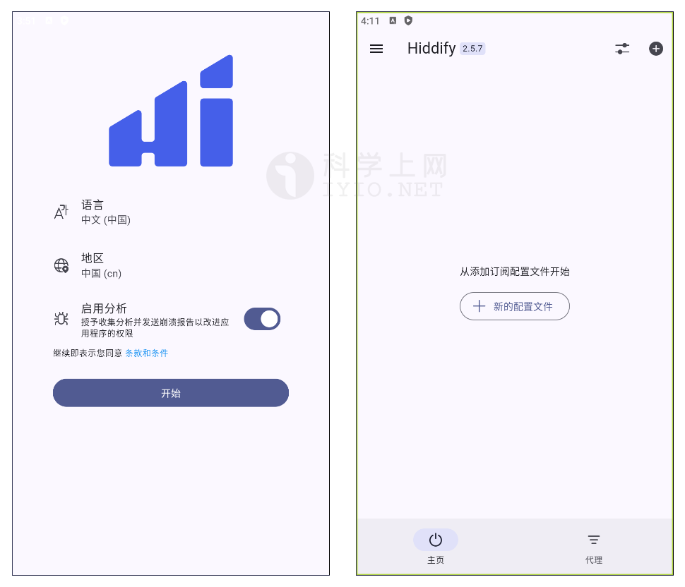
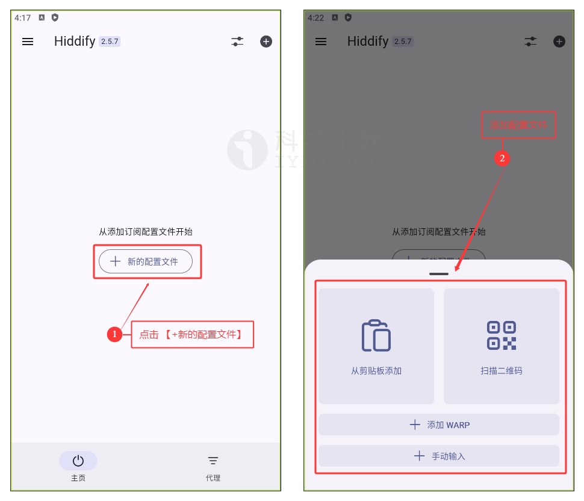
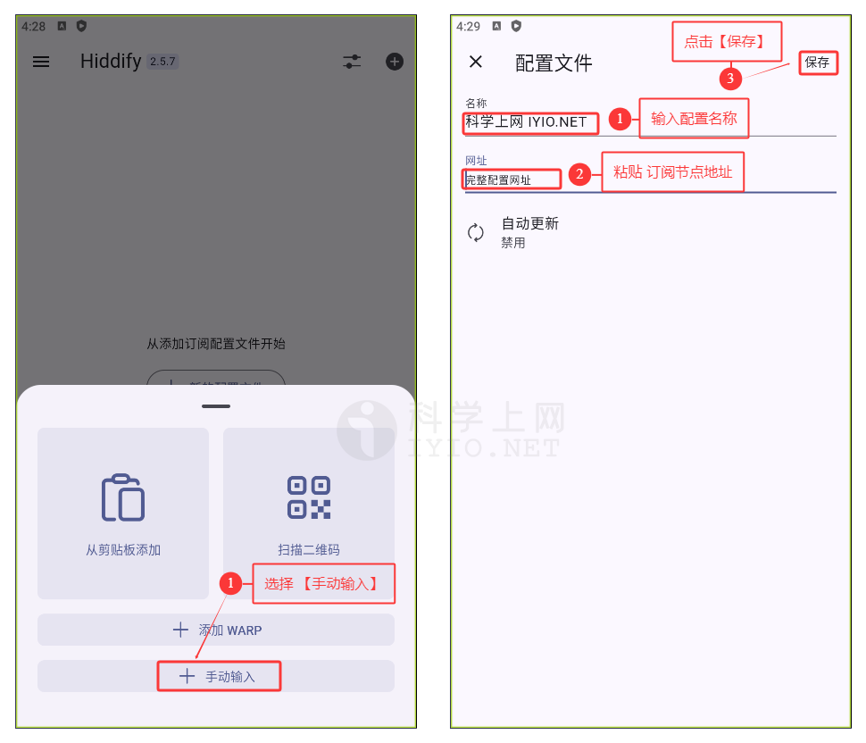
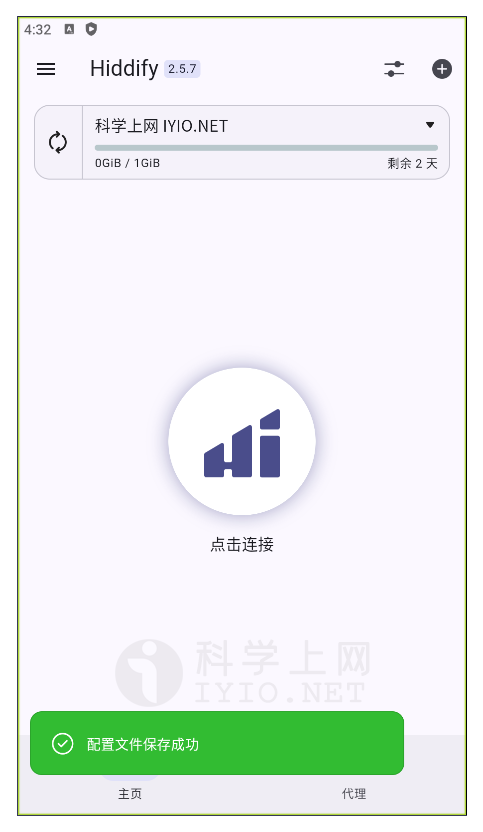
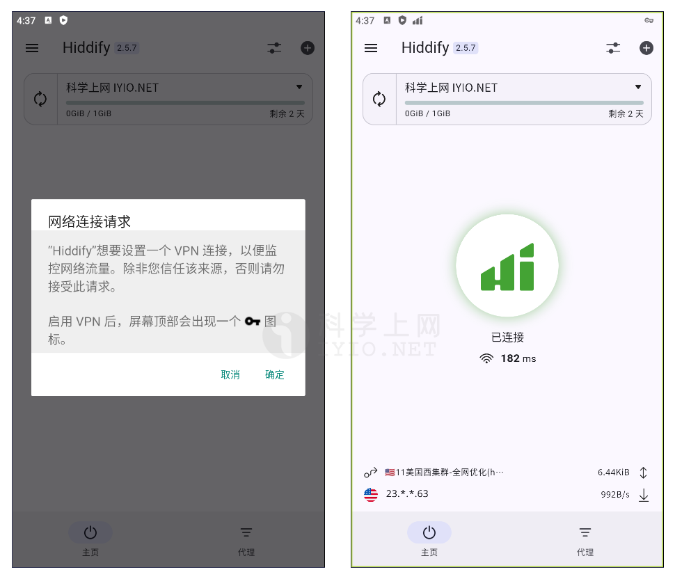
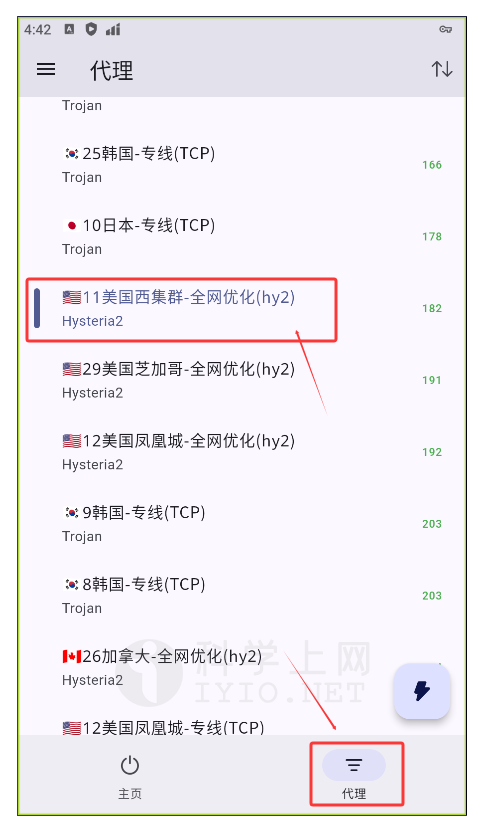
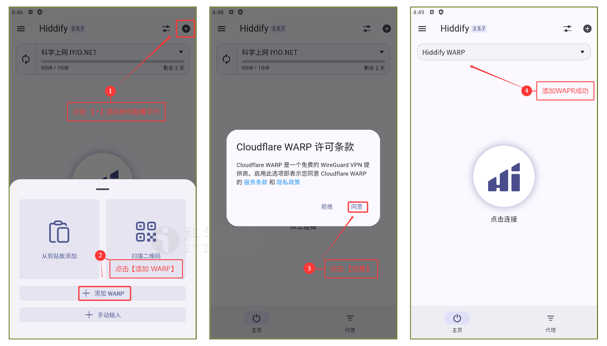

## Hiddify For Android 下载地址及使用教程 科学上网客户端下载使用汇总

**Hiddify** 基于Sing-box通用代理工具链的多平台代理客户端。Hiddify 提供多种功能，如自动节点选择、TUN 模式、远程配置文件等。Hiddify 是无广告且开源的。持多Vless、Vmess、Reality、TUIC、Hysteria、Wireguard、SSH 等种协议，支持：Sing-box、V2ray、Clash、Clash meta订阅链接及配置格式。 为访问免费互联网提供了一种安全且私密的方式。

## Hiddify For Android 界面预览

*Hiddify For Android 界面预览*

## Hiddify For Android 下载

### 下载地址

新手使用建议下载稳定版本，即版本号后标记为 `Latest` 的版本。

| 客户端                  | 版本号(Latest)                   | 更新日期                                         | 下载地址                                                     |
| ----------------------- | -------------------------------- | ------------------------------------------------ | ------------------------------------------------------------ |
| **Hiddify For Android** |  |  | [GitHub 下载](https://github.com/hiddify/hiddify-app/releases) / [Google Play](https://play.google.com/store/apps/details?id=app.hiddify.com) |

更多优秀的代理上网客户端，查看[《Windows 、Android 、IOS、macOS 全平台科学上网工具 APP客户端下载汇总》](https://github.com/free-nodes/fanqiang)

### 版本选择

在官网下载地址中，有众多版本可供下载，如下表所示，其中文件名当中的数字为版本号，版本号之后跟着的是平台名称及包名称。

| 文件名                           | 说明                            |
| -------------------------------- | ------------------------------- |
| Hiddify-Android-arm64.apk        | 安卓 Android 系统 arm64 架构    |
| Hiddify-Android-arm7.apk         | 安卓 Android 系统 arm7          |
| Hiddify-Android-universal.apk    | 安卓 Android 系统 通用          |
| Hiddify-Android-x86_64.apk       | 安卓 Android 系统 x86_64架构    |
| Hiddify-Debian-x64.deb           | Linux Debian 系统 安装包        |
| Hiddify-iOS.ipa                  | iOS 系统 ipa 安装包             |
| Hiddify-Linux-x64.AppImage       | Linux Ubuntu 系统 安装包        |
| Hiddify-MacOS-Installer.pkg      | macOS 系统 pkg 安装包           |
| Hiddify-MacOS.dmg                | macOS 系统 dmg 安装包           |
| Hiddify-rpm-x64.rpm              | Linux RedHat 系统 安装包        |
| Hiddify-Windows-Portable-x64.zip | Windows 64位 系统 绿色 免安装版 |
| Hiddify-Windows-Setup-x64.exe    | Windows 64位 系统 exe 安装包    |
| Hiddify-Windows-Setup-x64.msix   | Windows 64位 系统 Msix 安装包   |
| Source code (zip)                | 源文件压缩包 zip 版本           |
| Source code (tar.gz)             | 源文件压缩包 tar.gz 版本        |

## Hiddify For Android 安装教程

安装教程很简单，如果是通过应用商店下载的，那么直接根据提示下载并安装即可，如果是通过官网下载或其他第三方下载的，下载完后获得文件为 `Hiddify-Android-universal.apk `文件，其中后缀 `.apk` 为安卓系统的安装包，然后点击安装即可，十分简单。

安装完后，打开软件进入主界面，点击开始 即配置文件界面，如下图所示。

*v2rayNG 主界面*

## 准备订阅节点

节点即软件中的配置文件，在使用之前，首先需要添加一个 **Qv2ray 服务器节点**，即服务端才能使用代理上网功能，由于软件支持VMess、VLESS、Shadowsocks、Socks、Trojan等代理协议不同，根据软件不同选择对应协议的服务器节点。

如需免费节点可以使用本站[免费节点](https://github.com/free-nodes/v2rayfree)。免费节点资源少或者觉得免费节点不稳定的话可以考虑购买收费节点。收费节点一般都有多个数据中心及套餐可选。

#### 机场推荐：

- 【 [ORYMI（点击注册）](https://orymi.net/#/register?code=rDsEp8Hf)】 免费观看netflix、disney+、primevideo、hbomax 九折优惠码：LxwSsaay
- 【 [星辰加速（点击注册）](https://starlinkboost.com/#/register?code=9kfk8enH)】 150G/9元/月 免账号观看disney+ 九折优惠码：3UJuVnqS

如果对稳定性及隐私性要求高且有一定的要求，推荐自己搭建节点，速度有保证且安全性也最高，具体搭建教程可参考本站的节点[VPN搭建](https://github.com/free-nodes/vpn)相关教程。

## Hiddify For Android 使用教程

### 添加配置文件

添加配置文件一般有如下两种方式：

- Remote Profile 远程订阅地址
- Local Profile 本地配置文件

远程订阅地址即通过 URL 链接导入，一般的服务商都会直接提供节点地址，直接复制服务商提供的节点订阅地址即可，如下图所示：

点击软件主界面【➕**新的配置文件**】按钮即可出现添加配置文件选项，如下图所示，根据不同的节点添加不同的节点服务器配置文件。

*新的配置文件*

在弹出的窗口选择**【从剪贴板添加】**或**【手动输入】**，一般选择**【手动输入】**，如下图所示。输入 **配置文件名称** 及 **节点订阅地址**，然后点击右上角的**【保存】**，如下图所示。

*添加配置文件*

成功导入节点配置文件后如下图所示。

*成功导入配置文件*

### 开启代理

点击【点击链接】，首次使用，在弹出的 **网络连接请求** 点击【**确定**】即可开启代理。

*开启代理*

### 选择代理节点

在添加完订阅地址之后，如果需要**切换代理节点**，点击软件主界面下方的**【代理】**选项卡，在代理列表里选择一个合适的代理节点即可，如下图所示。

*选择代理节点*

### CloudFlare WARP 免费 VPN

#### 什么是WARP

**WARP** 全称为 Cloudflare WARP 是 Cloudflare 推出的一项免费 VPN 服务。 WARP 旨在提供更安全、更快速的互联网连接，保护用户的在线隐私和安全。由于 Cloudflare 有着全球最强大的 IP 库，所以基本不用担心被封锁的问题。

#### 添加WARP

点击界面右侧侧菜单**【➕】**，在弹出的窗口选择**【添加WARP】**，软件会自动注册并添加 **WARP** 。成功添加WARP后如下图所示。。

*添加WARP*

## 常见问题

Hiddify 支持哪些代理协议？

支持V2Ray、Xray、Reality、TUIC、Wireguard、Hysteria、SSH等代理协议。

