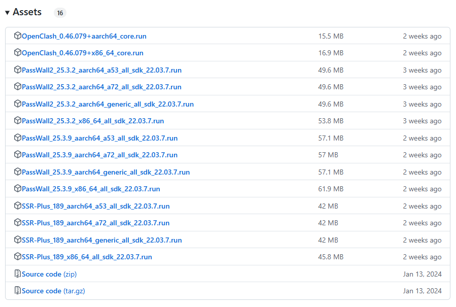
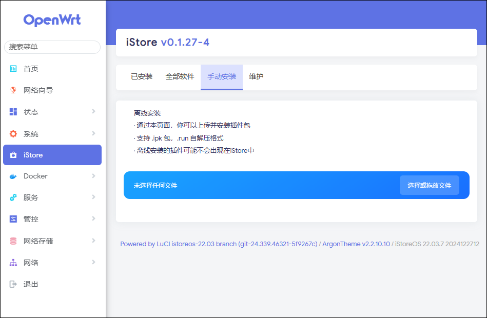

## iStoreOS 固件 安装passwall、OpenClash 教程

## iStoreOS 是什么

iStoreOS 是一个用openwrt二开的程序，目标是提供一个人人会用的路由兼轻 NAS 系统，不管是作为路由还是 NAS，你都有相似的操作体验。最近新出了一个飞牛os，也是nas系统，感兴趣的也可以试试。不过轻路由还是这个香。

## iStoreOS 如何安装 passwall

在 GitHub 下载对应的.run 文件，下载地址：https://github.com/bcseputetto/Are-u-ok/releases。

该项目里 passwall、passwall2、ssr-plus使用 **22.03.X sdk**编译，依旧使用libopenssl1.1，无需libopenssl3依赖，安装后在服务里。

下载后，来到iStore应用商店页面，点击**手动安装**，点击**选择上传或者直接拖放文件**

