## Openwrt 科学上网插件 Passwall 安装及设置教程

## 什么是 Passwall

**PassWall** 是Lineol 基于ShadowsocksR-Plus 修改的 OpenWrt 科学上网插件。同时具有分流、故障转移、自动恢复的功能，搭配自带的HaProxy负载均衡极大的保证了科学上网的稳定性与安全性。

## Passwall 界面预览

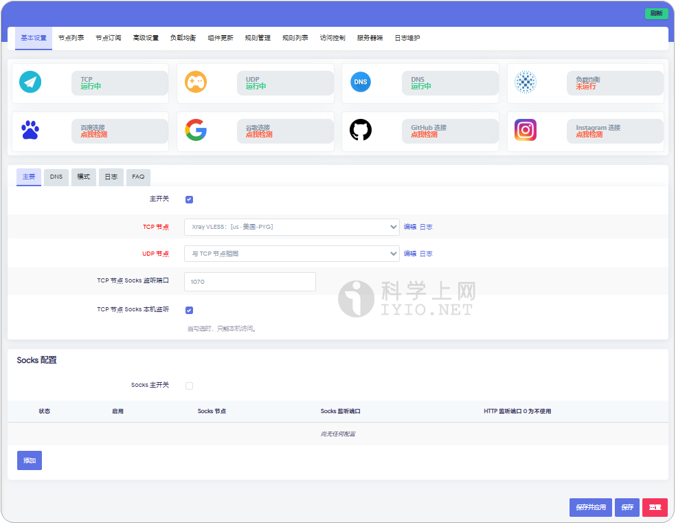*Passwall 主界面预览*

## Passwall 安装

目前 OpenWrt 的官方固件版本为 24.10.x，而第三方编译的固件例如 iStoreOS 使用的为 22.3.x ，对此 iStoreOS固件建议使用Passwall.run安装方式一键安装。

### 下载地址

| 项目名               | 版本号(Latest)                        | 更新日期                                              | 下载地址                                                     | 备注                                |
| -------------------- | ------------------------------------- | ----------------------------------------------------- | ------------------------------------------------------------ | ----------------------------------- |
| **Passwall**         |  |  | [GitHub 下载](https://github.com/xiaorouji/openwrt-passwall/releases) | 适用于OpenWrt 23.0X.X +             |
| **Passwall.run**文件 |          |          | [GitHub 下载](https://github.com/bcseputetto/Are-u-ok/releases) | 适用于22.03.X的软件包 例如 iStoreOS |

## Passwall 安装教程

下载SSH连接工具 Finalsell 链接OpenWrt的SSH,通过一下命令查看CPU架构。

SSH登录 主机：OpenWrt的IP地址 。端口：22 。用户名：root 。 密码：OpenWrt登录密码

```
cat /etc/os-release |grep ARCH
```

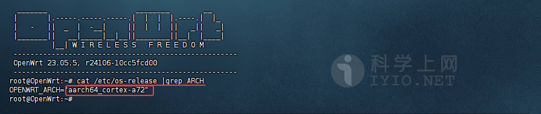

选择上方的 Passwall 项目，下载需要的文件：

- **luci-19.07_luci-app-passwall_x.x.s-x_all.ipk**：软件本体
- **luci-19.07_luci-i18n-passwall-zh-cn_x.x.s-x_all.ipk**：中文语言包
- **passwall_packages_ipk_XXXX.zip**：依赖文件。这里根据自己CPU架构选择，

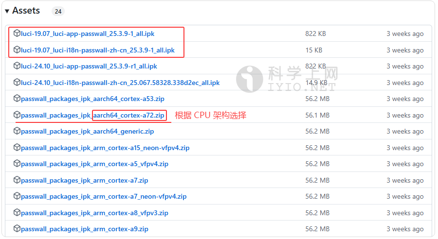

打开 OpenWrt 的管理界面，选择「**系统**」>「**软件包**」。选择「**上传软件包**」上传软件包。 选择「**浏览**」找到刚才下载的中文语言包，点击「**上传**」进行上传安装。

先安装依赖文件，再分别安装主程序文件和语言包。

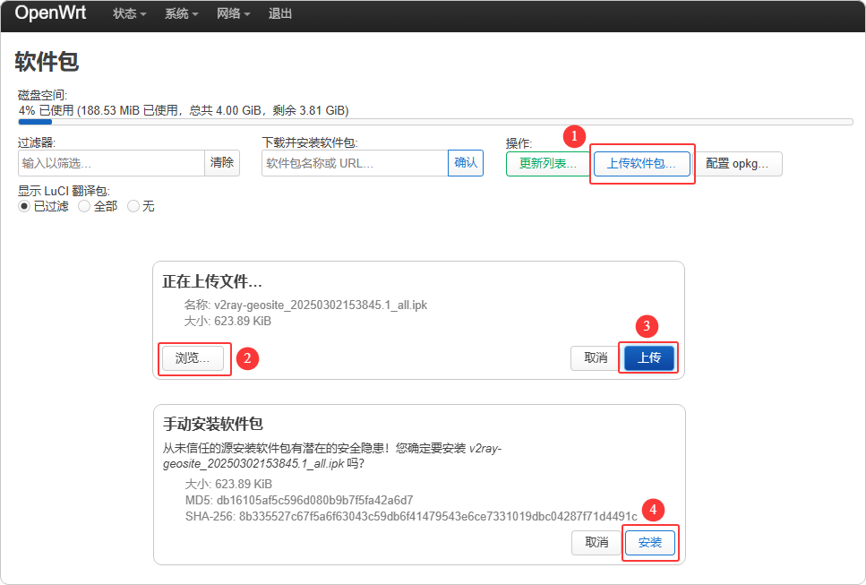

如果报错，移除 `dnsmasq`，安装`dnsmasq-full`, `kmod-nft-socket`、`kmod-nft-tproxy`、`kmod-nft-nat`等FW4依赖包

安装完成后，在「**服务**」列表找到 - 「**passwall**」。

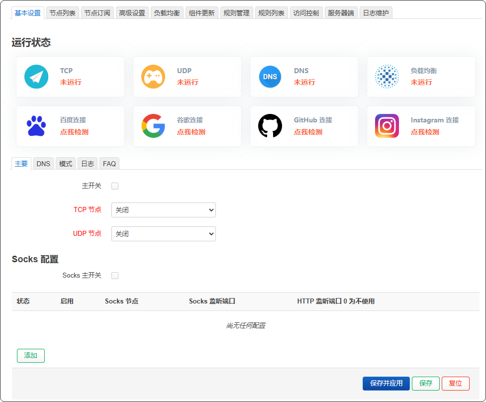

Passwall.run 文件安装请参考：[iStoreOS 固件 安装passwall 教程](./iStoreOS.md)。

## 准备订阅节点

节点即软件中的配置文件，在使用之前，首先需要添加一个 **Qv2ray 服务器节点**，即服务端才能使用代理上网功能，由于软件支持VMess、VLESS、Shadowsocks、Socks、Trojan等代理协议不同，根据软件不同选择对应协议的服务器节点。

如需免费节点可以使用本站[免费节点](https://github.com/free-nodes/v2rayfree)。免费节点资源少或者觉得免费节点不稳定的话可以考虑购买收费节点。收费节点一般都有多个数据中心及套餐可选。

#### 机场推荐：

- 【 [ORYMI（点击注册）](https://orymi.net/#/register?code=rDsEp8Hf)】 免费观看netflix、disney+、primevideo、hbomax 九折优惠码：LxwSsaay
- 【 [星辰加速（点击注册）](https://starlinkboost.com/#/register?code=9kfk8enH)】 150G/9元/月 免账号观看disney+ 九折优惠码：3UJuVnqS

如果对稳定性及隐私性要求高且有一定的要求，推荐自己搭建节点，速度有保证且安全性也最高，具体搭建教程可参考本站的节点[VPN搭建](https://github.com/free-nodes/vpn)相关教程。

## Passwall 使用教程

### 添加单条节点

在【**节点列表**】页面点击【**添加**】，如下图所示：

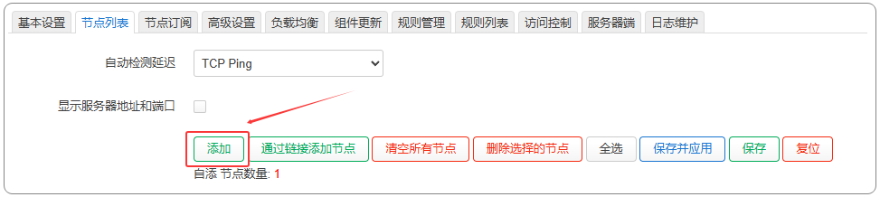

在【**节点配置**】点击【**导入分享URL**】，粘贴订阅信息，或者手动填写信息，点击**保存并应用**。如下图所示：

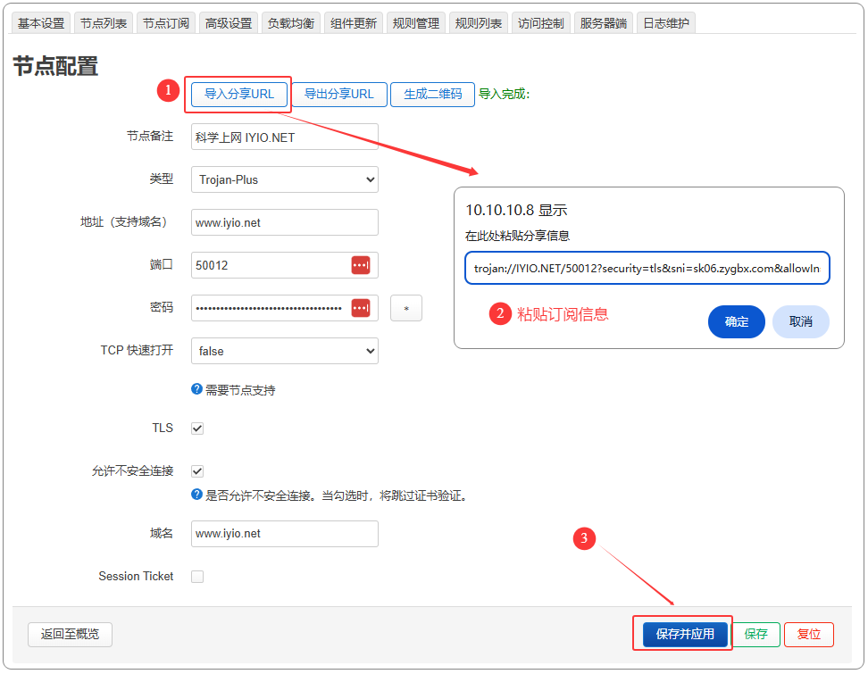

点击【**节点列表**】即可查看添加的节点信息。

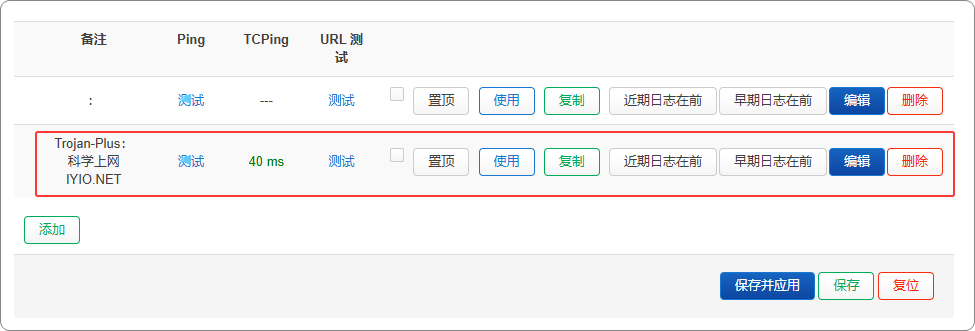

### 通过链接添加订阅

远程订阅地址即通过 URL 链接导入，一般的服务商都会直接提供节点地址，直接复制服务商提供的节点订阅地址即可，如下图所示：


然后点击界面菜单**【节点订阅】**，在页面底部点击**【添加】**，如下图所示。

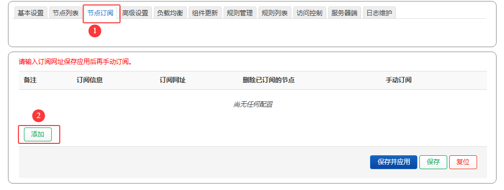

在**【订阅链接】**黏贴订阅链接，订阅备注填写机场名称或随便填写，最后点击 **保存并应用** 。如果是机场订阅链接，建议开启自动更新功能。如下图所示。

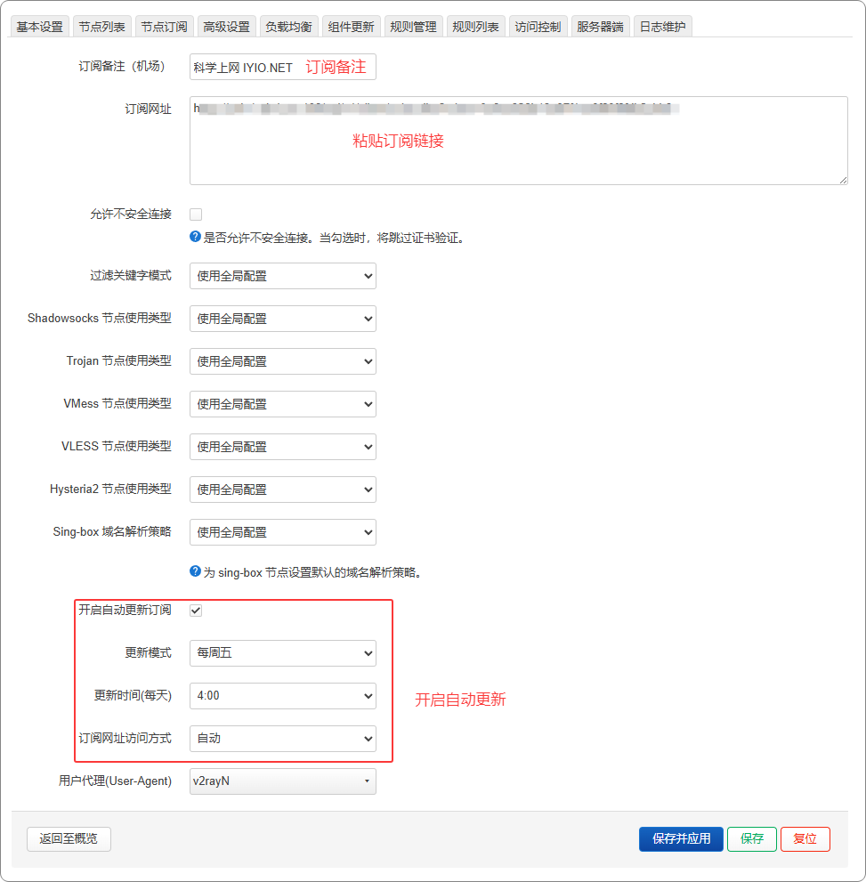

找到刚添加的订阅信息，点击【**手动订阅**】 Passwall 将自动从订阅链接获取最新的节点信息。

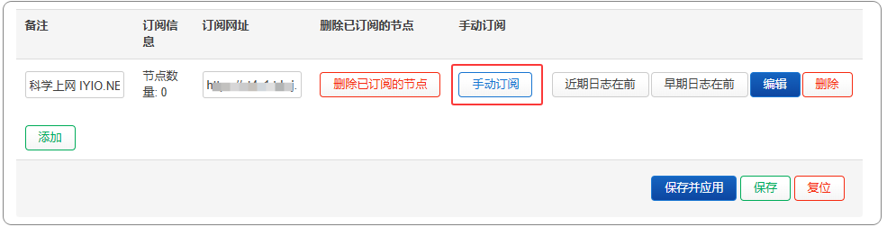

点击【**节点列表**】即可查看所有节点信息。

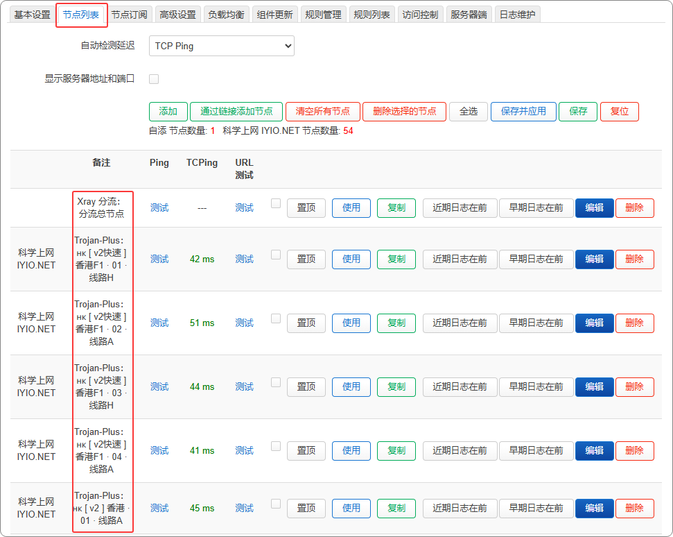

## 开启代理

在【**基本设置**】页面，勾选**主开关**，选择 **TCP 节点**与 **UDP 节点** ，点击保存并应用。

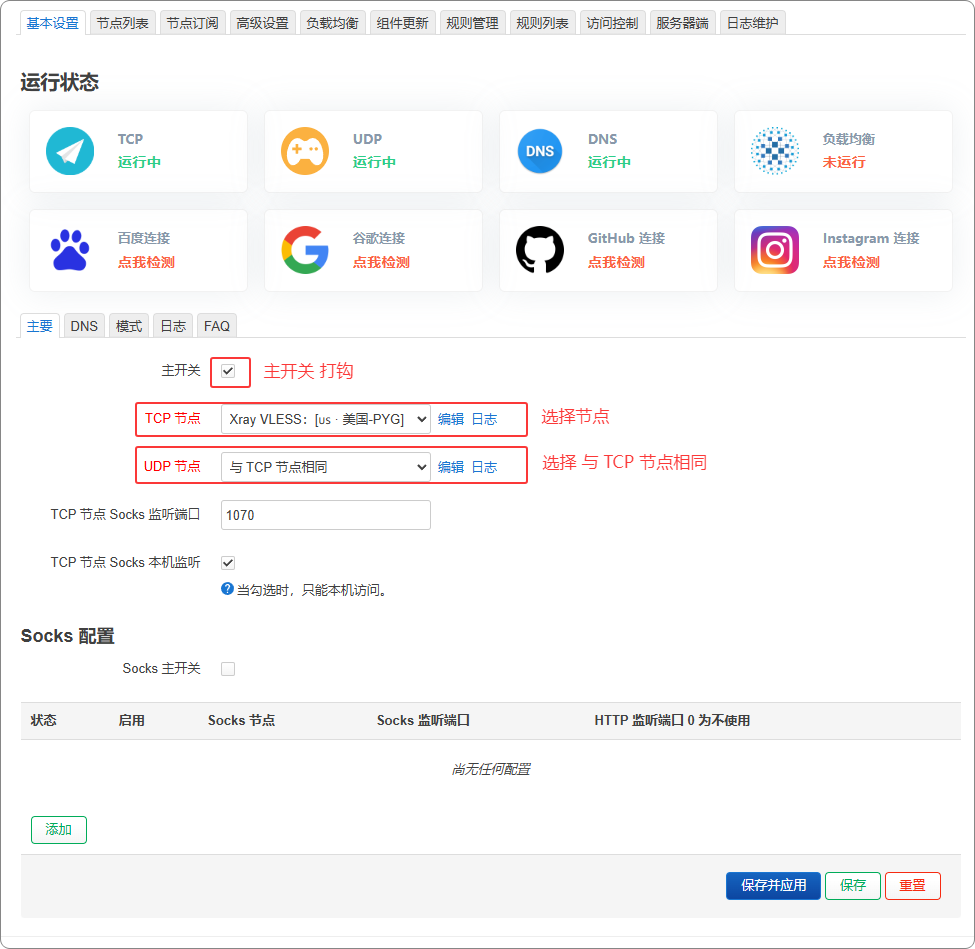

恭喜你！你已经可以成功科学上网！

## 其他设置

**DNS**：基本设置界面选择**DNS**，建议默认即可。

**代理模式**：基本设置界面选择**模式**。可以设置 **GFW 列表**、**中国列表以外**、**中国列表**、**全局代理**，根据自己需求选择。

**组件更新**：在组件更新更新界面点击各个组件 **检查更新** 更新即可，Passwall 版本不支持在线更新。

**规则更新**：在规则管理界面，开启自动更新规则。

