## Qv2ray For Windows 下载地址及使用教程 科学上网客户端下载使用汇总

**Qv2ray** 是基于 V2Ray 内核的代理软件客户端，跨平台支持 Windows、Linux、macOS 系统，并且支持多种代理协议，如V2Ray(VMess)、Xray(VLESS)、Trojan、NaiveProxy、Shadowsocks(R)等多种协议，遗憾的是Qv2ray已于2021年8月17日**停止维护**，最新版本为**v2.7.0**，但其功能强大、支持跨平台及插件功能，依然是值得推荐的科学上网客户端。

## Qv2ray 界面预览

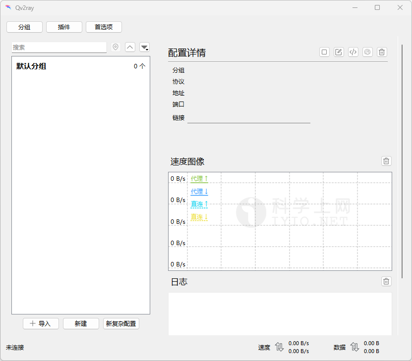*Qv2ray 主界面预览*

## Qv2ray 官网下载

### 下载地址

| 客户端     | 版本号(Latest)              | 更新日期                                     | 下载地址                                                 |
| ---------- | --------------------------- | -------------------------------------------- | -------------------------------------------------------- |
| **Qv2ray** |  |  | [GitHub 下载](https://github.com/Qv2ray/Qv2ray/releases) |

更多优秀的代理上网客户端，查看[《Windows 、Android 、IOS、macOS 全平台科学上网工具 APP客户端下载汇总》](https://github.com/free-nodes/fanqiang)

### 版本选择

新手使用建议下载稳定版本，即版本号后标记为 `Latest` 的版本。

在官网下载地址中，有众多版本可供下载，如下表所示，其中文件名当中的数字为版本号，版本号之后跟着的是平台名称及包名称。

| 文件名                              | 说明                            |
| ----------------------------------- | ------------------------------- |
| Qv2ray-v2.7.0-linux-x64.AppImage    | Linux Ubuntu 系统 64位 安装包   |
| Qv2ray-v2.7.0-macOS-x64.dmg         | macOS 系统 64位 安装包          |
| Qv2ray-v2.7.0-Windows-Installer.exe | Windows 系统 64位 安装包        |
| Qv2ray-v2.7.0-Windows.7z            | Windows 系统 64位 绿色版 压缩包 |
| Source code (zip)                   | 源文件压缩包 zip 版本           |
| Source code (tar.gz)                | 源文件压缩包 tar.gz 版本        |

## Qv2ray 安装教程

### 软件安装

下载后放到软件安装目录，推荐放在非系统盘，解压压缩包，双击打开 **qv2ray.exe**，即可启动Qv2ray，如下图所示：

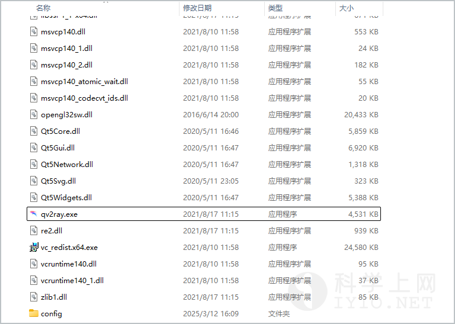

## 准备订阅节点

节点即软件中的配置文件，在使用之前，首先需要添加一个 **Qv2ray 服务器节点**，即服务端才能使用代理上网功能，由于软件支持VMess、VLESS、Shadowsocks、Socks、Trojan等代理协议不同，根据软件不同选择对应协议的服务器节点。

如需免费节点可以使用本站[免费节点](https://github.com/free-nodes/v2rayfree)。免费节点资源少或者觉得免费节点不稳定的话可以考虑购买收费节点。收费节点一般都有多个数据中心及套餐可选。

#### 机场推荐：

- 【 [ORYMI（点击注册）](https://orymi.net/#/register?code=rDsEp8Hf)】 免费观看netflix、disney+、primevideo、hbomax 九折优惠码：LxwSsaay
- 【 [星辰加速（点击注册）](https://starlinkboost.com/#/register?code=9kfk8enH)】 150G/9元/月 免账号观看disney+ 九折优惠码：3UJuVnqS

如果对稳定性及隐私性要求高且有一定的要求，推荐自己搭建节点，速度有保证且安全性也最高，具体搭建教程可参考本站的节点[VPN搭建](https://github.com/free-nodes/vpn)相关教程。

## Qv2ray For Windows 使用教程

### Qv2ray 机场 URL 订阅配置使用

远程订阅地址即通过 URL 链接导入，一般的服务商都会直接提供节点地址，直接复制服务商提供的节点订阅地址即可，如下图所示：

机场服务商通常会提供订阅地址，登录机场**复制订阅地址**，打开Qv2ray客户端，点击**【分组】**，如下图所示：

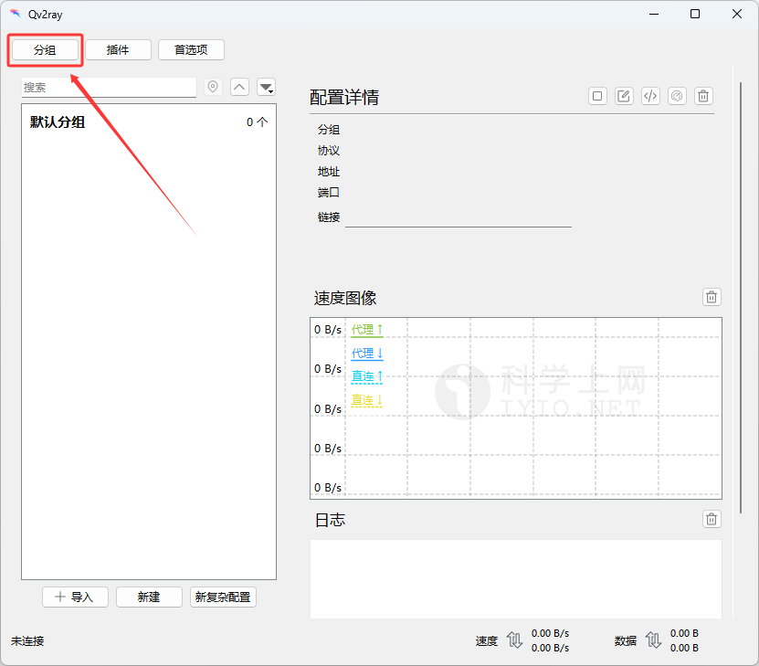

在 【**组编辑器**】 窗口中选择 【**默认分组**】 并点击右侧【**订阅设置**】标签，勾选【**此分组是一个订阅**】，将机场订阅地址粘贴至【**订阅地址**】输入框内并点击【**OK**】保存设置，如下图：

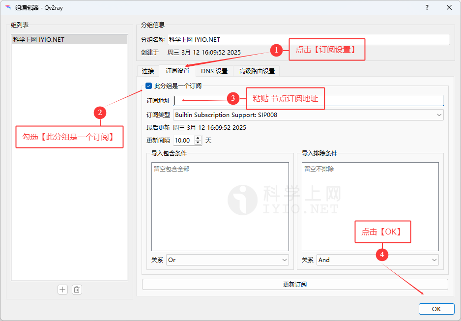

返回主界面，鼠标右键单击刚才设置订阅的分组点击【**更新订阅**】，即可加载该分组的机场订阅节点，如下图所示：

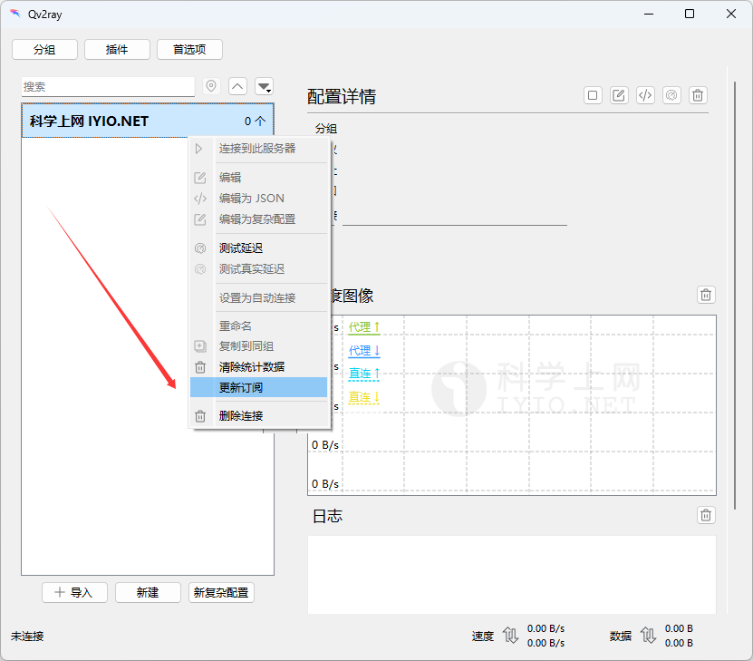

鼠标双击要连接的节点，或选择要连接的节点，点击右上角【▷】按钮，即可启动系统代理连接该节点，如下图所示：

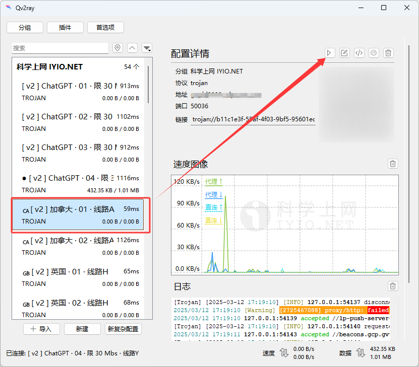

启动并连接成功后桌面右下角会收到已连接及设置系统代理消息通知，此时主界面右上角连接按钮变为【◻】，再次点击此按钮即断开连接，在任务栏右下角系统托盘找到Qv2ray软件的图标，右键单击图标也可以进行连接及断开等常用操作，如下图：

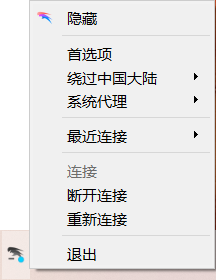

至此v2rayN安装配置及系统代理启动完成，可以科学上网了。

### Qv2ray 手动添加服务器节点

点击主界面左下角【**导入**】、【**新建**】及【**新复杂配置**】可手动批量导入或添加服务器节点，如下图：

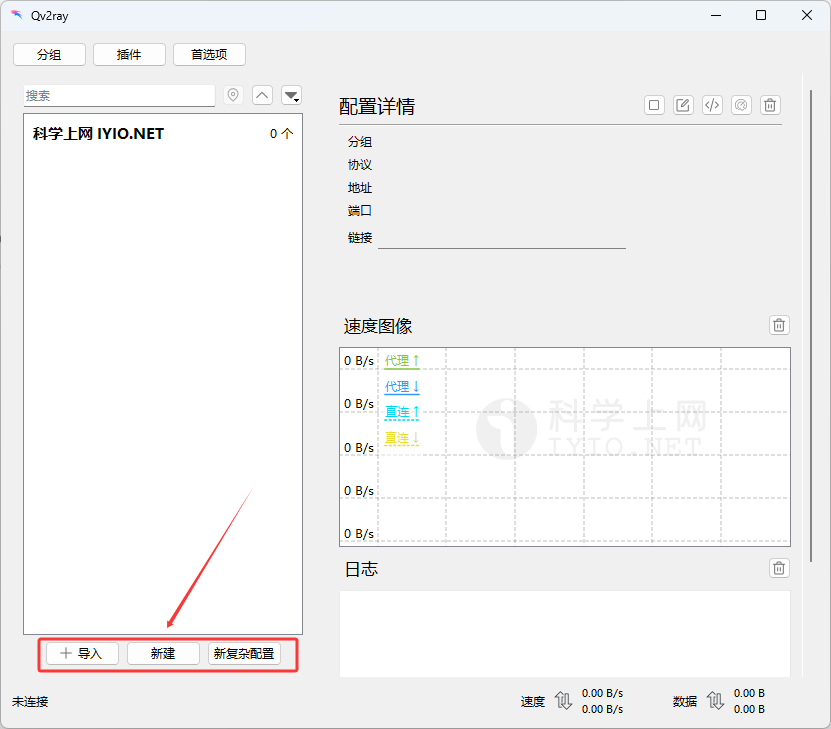

首先复制节点服务器的链接地址，常用的不同协议的地址如下所示：

- VMESS服务器v2Ray节点地址：**vmess://**
- VLESS服务器Xray节点地址：**vless://**
- Shadowsock服务器节点地址：**ss://**
- Trojan服务器节点地址：**trojan://**

点击【**导入**】按钮，在 {**导入文件**} 窗口将节点链接粘贴至左侧【**分享链接**】输入框内，并点击【**导入**】按钮即可，如下图所示：

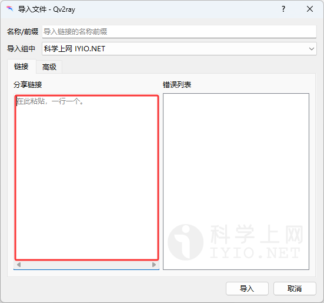

### Qv2ray 内核设置

Qv2ray客户端软件必须配置V2Ray内核才能使用，下载Qv2ray官方原版则需要下载V2Ray内核并手动配置，点击主界面【首选项】按钮，如下图：

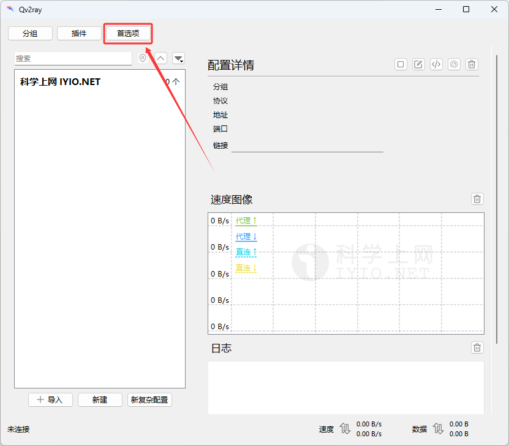

点击【**内核设置**】，可查看到当前V2Ray内核路径，默认为 `Qv2ray软件目录/config/vcore/` ，下载V2Ray内核压缩包并解压至该目录或点击右侧【**选择**】按钮将 {**V2Ray核心可执行文件路径**} 及 {**V2Ray资源目录**} 指向V2Ray内核路径，点击【**检查V2Ray核心设置**】按钮，如下图所示：

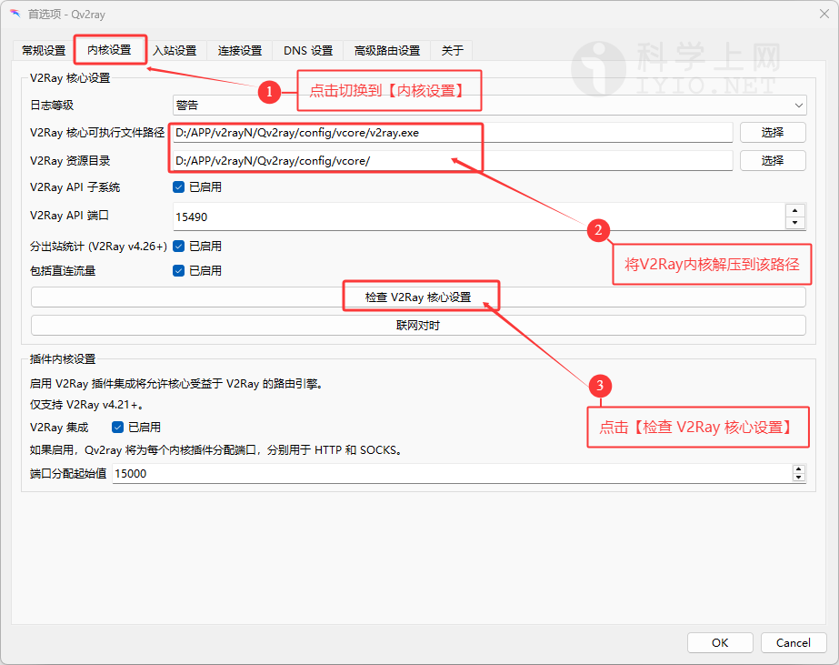

V2Ray内核检查通过会提示V2Ray版本信息，如下图所示：

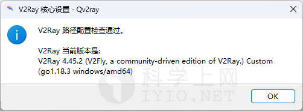

更多优秀的代理上网客户端，查看[《Windows 、Android 、IOS、macOS 全平台科学上网工具 APP客户端下载汇总》](https://github.com/free-nodes/fanqiang)Qv2ray For Windows 下载地址及使用教程 科学上网客户端下载使用汇总

