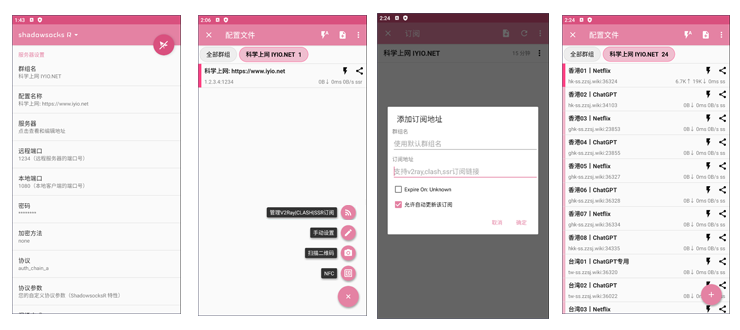
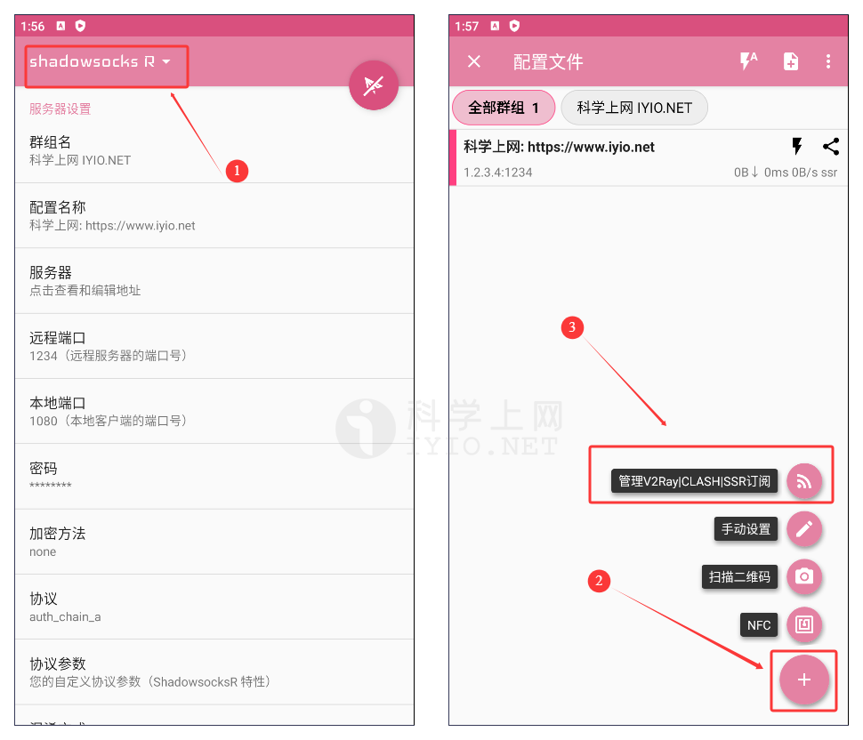
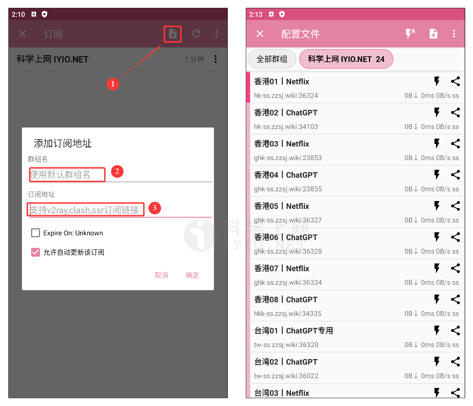
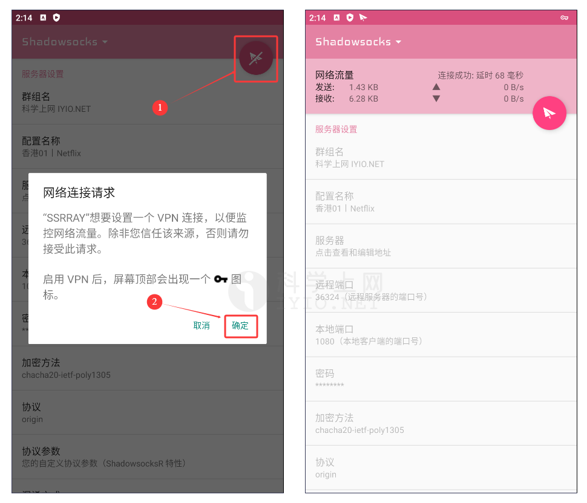

## ShadowsocksR 下载地址及使用教程 科学上网客户端下载使用汇总

## 简介

**ShadowsocksR** 是一个功能齐全的ShadowsocksR、V2Ray和Trojan安卓客户端，又称“小飞机”。ShdowsocksR 用 Scala 编写，基于 Shadowsocks 的分支版本。它提供了 Shadowsocks 当时不具有的流量混淆（ Shadowsocks 后期已经支持 OBFS 混淆）和多连接协议支持。但是原作者已经于 2017 年停止了 ShadowsocksR 的开发。

本教程将以 以及 xxf098 的 SSRRAY 客户端为范例进行操作。SSRR 的操作方法与 Rixcloud 客户端大同小异，可直接对照学习。

## 界面预览

*界面预览*

## ShadowsocksR 下载

### 下载地址

新手使用建议下载稳定版本，即版本号后标记为 `Latest` 的版本。

| 客户端           | 版本号(Latest)                                         | 更新日期                                                     | 下载地址                                                     |
| ---------------- | ------------------------------------------------------ | ------------------------------------------------------------ | ------------------------------------------------------------ |
| **ShadowsocksR** |  |  | [GitHub 下载](https://github.com/xxf098/shadowsocksr-v2ray-trojan-android) |

更多优秀的代理上网客户端，查看[《Windows 、Android 、IOS、macOS 全平台科学上网工具 APP客户端下载汇总》](https://github.com/free-nodes/fanqiang)

## 准备订阅节点

节点即软件中的配置文件，在使用之前，首先需要添加一个 **Qv2ray 服务器节点**，即服务端才能使用代理上网功能，由于软件支持VMess、VLESS、Shadowsocks、Socks、Trojan等代理协议不同，根据软件不同选择对应协议的服务器节点。

如需免费节点可以使用本站[免费节点](https://github.com/free-nodes/v2rayfree)。免费节点资源少或者觉得免费节点不稳定的话可以考虑购买收费节点。收费节点一般都有多个数据中心及套餐可选。

#### 机场推荐：

- 【 [ORYMI（点击注册）](https://orymi.net/#/register?code=rDsEp8Hf)】 免费观看netflix、disney+、primevideo、hbomax 九折优惠码：LxwSsaay
- 【 [星辰加速（点击注册）](https://starlinkboost.com/#/register?code=9kfk8enH)】 150G/9元/月 免账号观看disney+ 九折优惠码：3UJuVnqS

如果对稳定性及隐私性要求高且有一定的要求，推荐自己搭建节点，速度有保证且安全性也最高，具体搭建教程可参考本站的节点[VPN搭建](https://github.com/free-nodes/vpn)相关教程。

## ShdowsocksR使用教程

### 添加配置文件

点击 ShdowsocksR 首页左上角的 “**ShdowsocksR**” 图标。在 **配置文件** 页面点击右下角 【**＋**】 。

*添加配置文件*

点击 “**添加订阅地址**” ，在弹出的输入框中键入 订阅地址，完成后点击“**确定**” ,勾选 “**自动更新**” ，点击 “**确定**” 。

*添加订阅地址*

在首页，点击右上角的纸飞机图标，在弹出的设置 VPN 中点击 “**允许**”，ShadowsocksR 便开始接管系统流量。

*开启订阅*

## Tips:

使用内置分流规则

- 在 ShadowsocksR 首页向下滑动，在 “路由” 中选择分流方案。

使用第三方分流规则

- 在 “路由” 中选择 “自定义 ACL 文件”，填入自定义 ACL 分流文件地址。
- 滑动到底部，点击 “ACL 文件更新” 。

## 更多

- 如果您发现 Instagram 等境外社交软件无法加载内容，请勾选 “IPv6 转发” 选项，一般都可以解决。
- 建议将 ShadowsocksR 加入系统电池策略的白名单中，并锁定后台，以避免出现后台进程被系统干掉后无法进行科学上网。