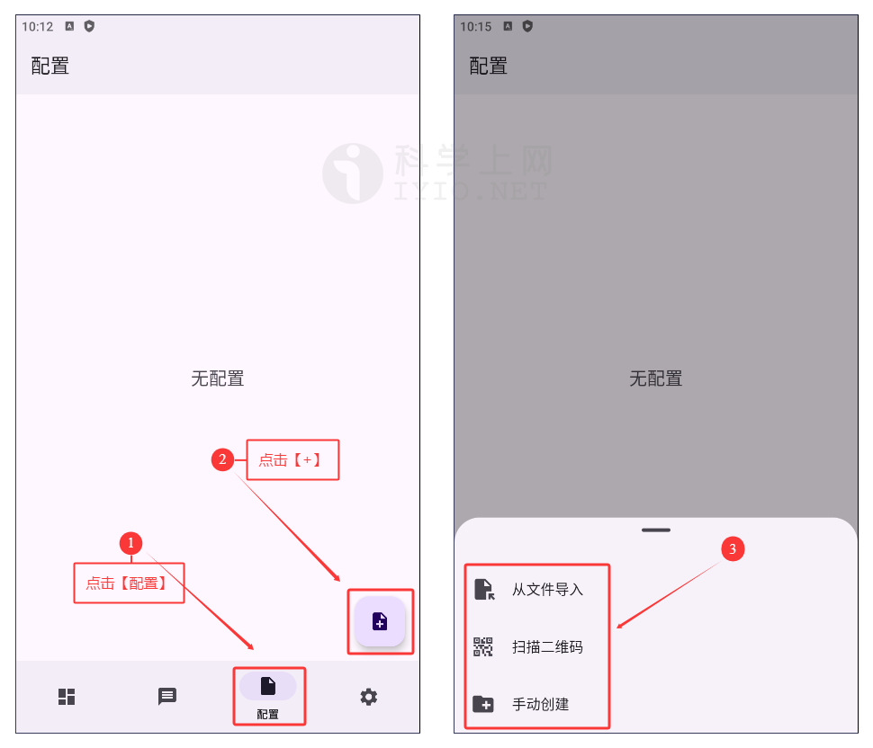
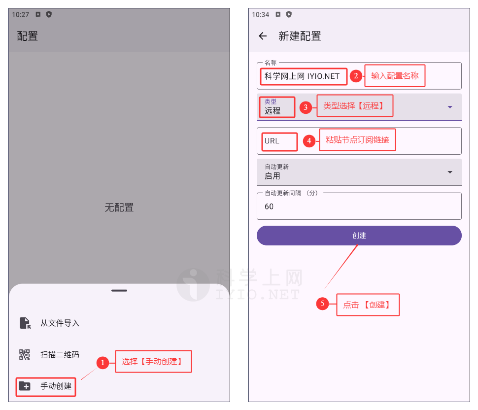
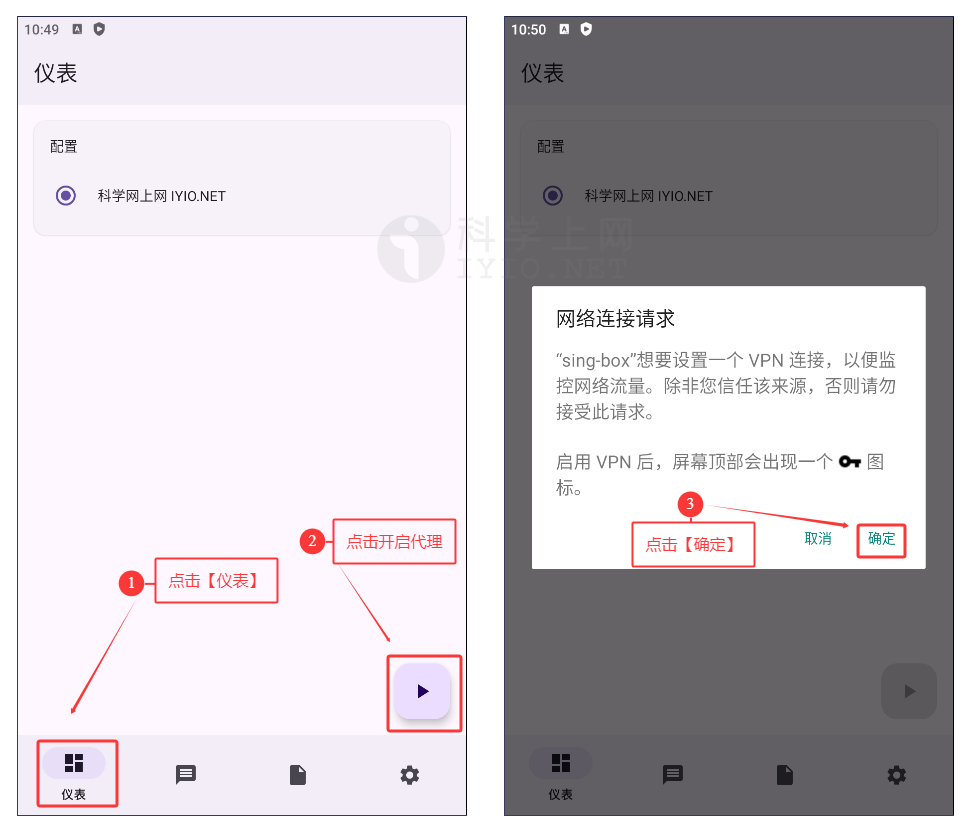
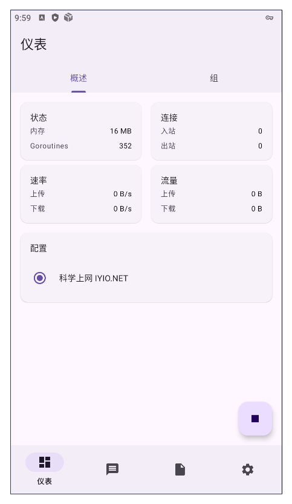

## sing-box For Android 下载地址及使用教程 科学上网客户端下载使用汇总

**sing-box** 是新一代超强通用代理工具，对标 *ray core 与 clash，而且它的性能以及支持的协议类型已经超过了 *ray core 与 clash。目前支持 **Shadowsocks**、**Vmess**、**Trojan**、**Hysteria**、**Vless**、**Redirect**、**Tuic**、**TProxy**、**Socks**等多种协议。

图形界面支持 **Android**、**iOS**、**macOS** 以及 **Apple tvOS**，~~Windows~~ 暂时不支持，还在施工中 🚧

## sing-box For Android 下载地址

新手使用建议下载稳定版本，即版本号后标记为 `Latest` 的版本。

| 客户端                   | 版本号(Latest)                | 更新日期                                      | 下载地址                                                     |
| ------------------------ | ----------------------------- | --------------------------------------------- | ------------------------------------------------------------ |
| **sing-box For Android** |  |  | [GitHub 下载](https://github.com/SagerNet/sing-box/releases) / [Google Play 下载](https://play.google.com/store/apps/details?id=io.nekohasekai.sfa) |

sing-box官方网站：https://sing-box.sagernet.org/zh/

更多优秀的代理上网客户端，查看[《Windows 、Android 、IOS、macOS 全平台科学上网工具 APP客户端下载汇总》](https://github.com/free-nodes/fanqiang)

## sing-box For Android 安装教程

安装教程很简单，如果是通过应用商店下载的，那么直接根据提示下载并安装即可，如果是通过官网下载或其他第三方下载的，下载完后获得文件为 `SFA-1.11.5-universal.apk` 文件，其中后缀 `.apk` 为安卓系统的安装包，`x.x.x` 代表软件平台，然后点击安装即可，十分简单。

部分国产手机可能会报毒，在此忽略报毒安装即可。有的国产系统可能需要在系统设置里进行额外操作。

安装完后，打开软件进入主界面，即仪表盘界面，如下图所示：

*sing-box For Android 仪表盘主界面*

## 准备订阅节点

节点即软件中的配置文件，在使用之前，首先需要添加一个 **Qv2ray 服务器节点**，即服务端才能使用代理上网功能，由于软件支持VMess、VLESS、Shadowsocks、Socks、Trojan等代理协议不同，根据软件不同选择对应协议的服务器节点。

如需免费节点可以使用本站[免费节点](https://github.com/free-nodes/v2rayfree)。免费节点资源少或者觉得免费节点不稳定的话可以考虑购买收费节点。收费节点一般都有多个数据中心及套餐可选。

#### 机场推荐：

- 【 [ORYMI（点击注册）](https://orymi.net/#/register?code=rDsEp8Hf)】 免费观看netflix、disney+、primevideo、hbomax 九折优惠码：LxwSsaay
- 【 [星辰加速（点击注册）](https://starlinkboost.com/#/register?code=9kfk8enH)】 150G/9元/月 免账号观看disney+ 九折优惠码：3UJuVnqS

如果对稳定性及隐私性要求高且有一定的要求，推荐自己搭建节点，速度有保证且安全性也最高，具体搭建教程可参考本站的节点[VPN搭建](https://github.com/free-nodes/vpn)相关教程。

## 软件使用教程

支持 sing-box 一键导入的机场，可直接跳至 **开启代理** 处。

### 添加配置文件

进入软件，选择【**配置**】点击【➕】新增配置，如下图所示一共有三种添加方式，分别是**从文件导入**、**扫描二维码**、**手动创建**。

*添加配置文件*

### 从文件导入

点击软件底部【**配置**】选项卡，点击【➕】号，然后选择【**从文件导入**】。

### 扫描二维码

首先从电脑打开服务器节点的二维码图片或者把二维码图片保存至手机，点击软件底部【**配置**】选项卡，点击【➕】号，然后选择【**扫描二维码**】，扫描电脑屏幕上的二维码或选择从手机相册打开二维码图片扫描配置文件二维码即可导入节点信息，如下图所示：

*扫描二维码*

### 手动创建【推荐】

远程订阅地址即通过 URL 链接导入，一般的服务商都会直接提供节点地址，直接复制服务商提供的节点订阅地址即可，如下图所示：

*复制订阅地址*

点击软件底部【**配置**】选项卡，点击【➕】号，然后选择【**手动创建**】，在 **新建配置** 页面的类型选择 **远程** ，如下图所示：

*手动创建*

#### 更新订阅

在【**配置**】页面，点击 **添加的节点** 然后点击下方的【**更新**】即可

*更新订阅*

### 开启代理

完成配置后切换至 【**仪表**】，**点击按钮** 开启代理，首次配置会提示是否创建代理，即软件界面中的网络链接请求，点击【**允许**】启动。

*开启代理*

成功开启代理后，可以注意到开关按钮的状态变化。【**仪表**】 显示了运行状态的预览。

*开启代理*

目前支持sing-box的订阅链接很少，订阅链接都需要转换。可自行搜索相关配置规则

