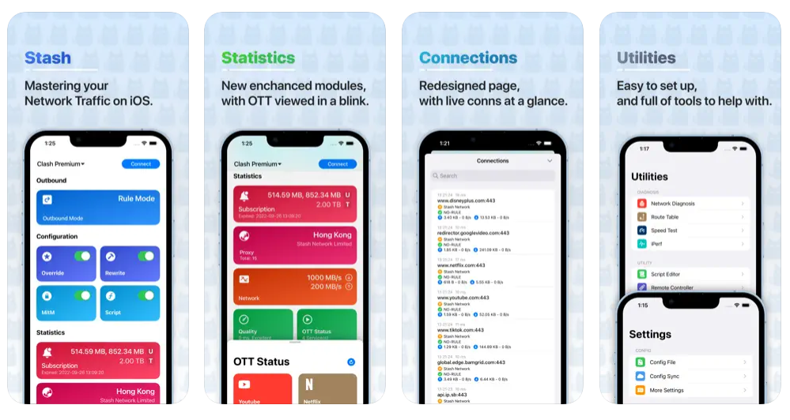
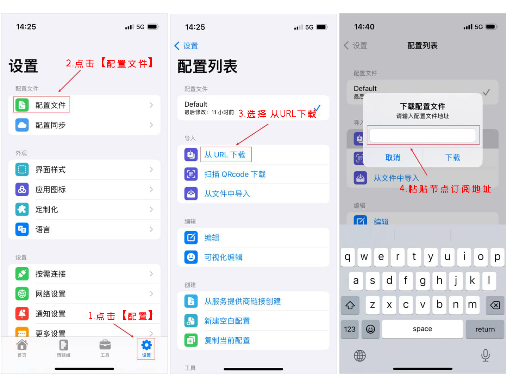
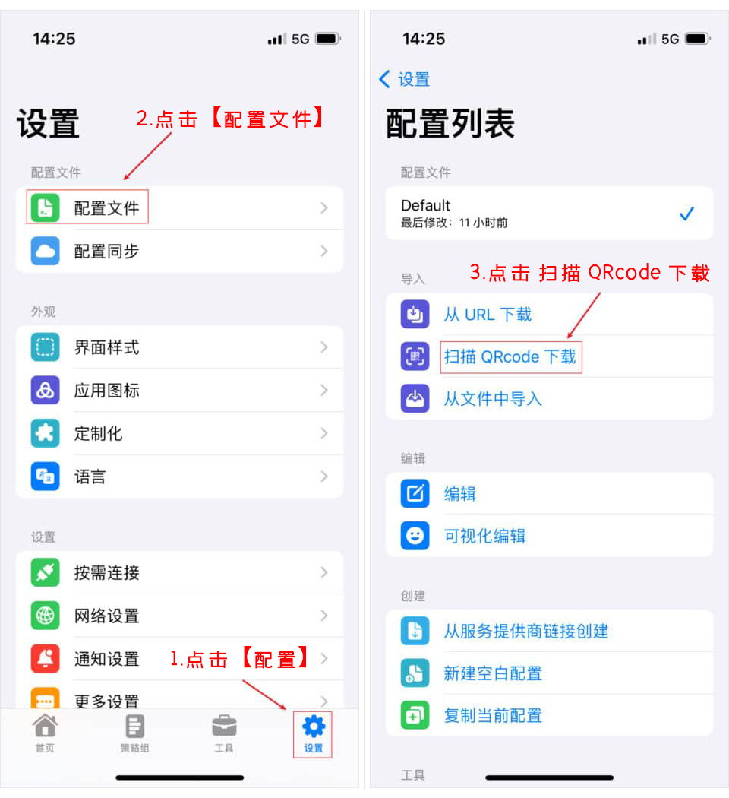
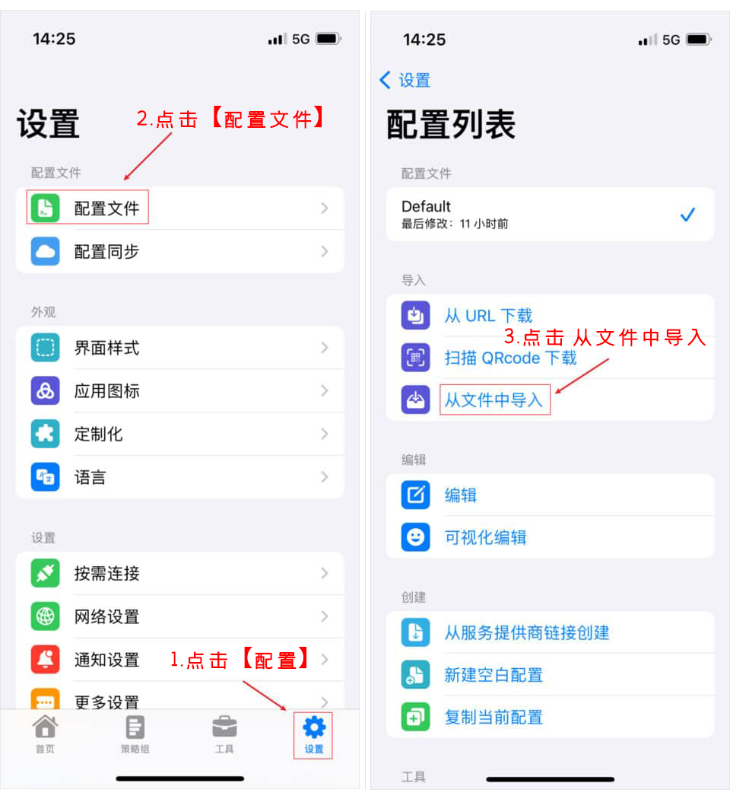
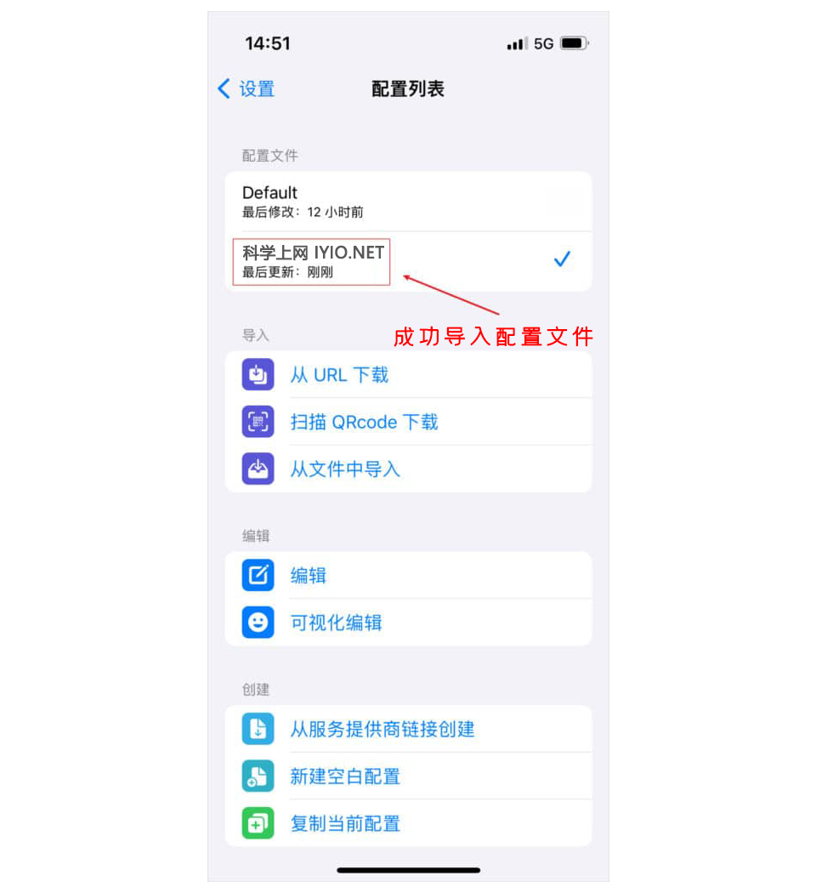
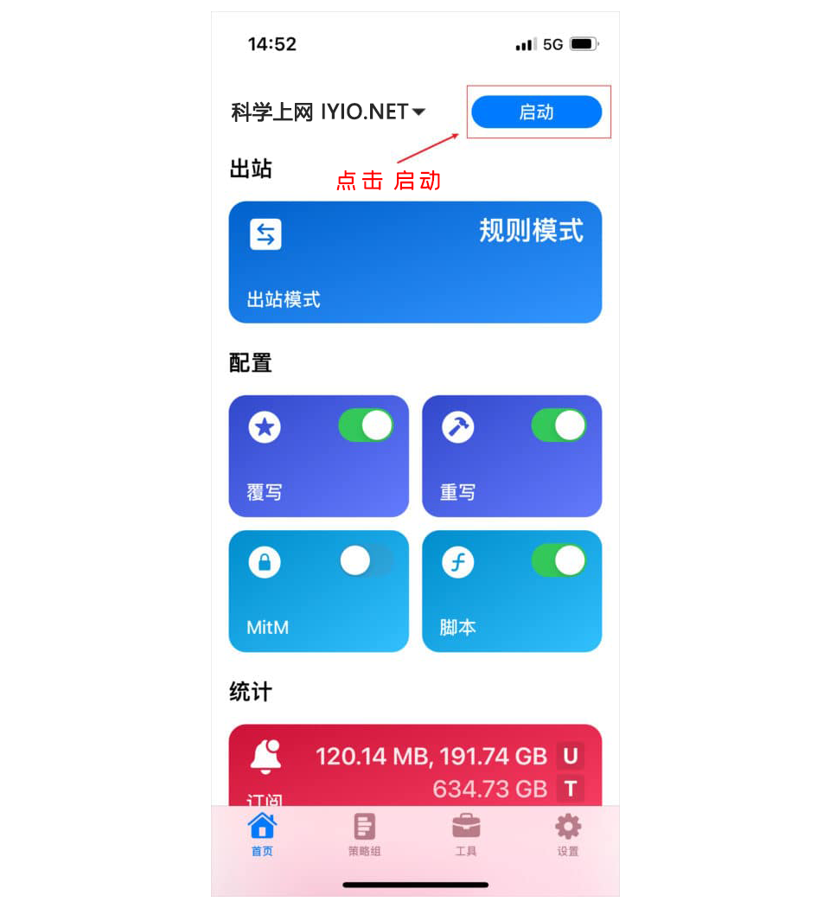
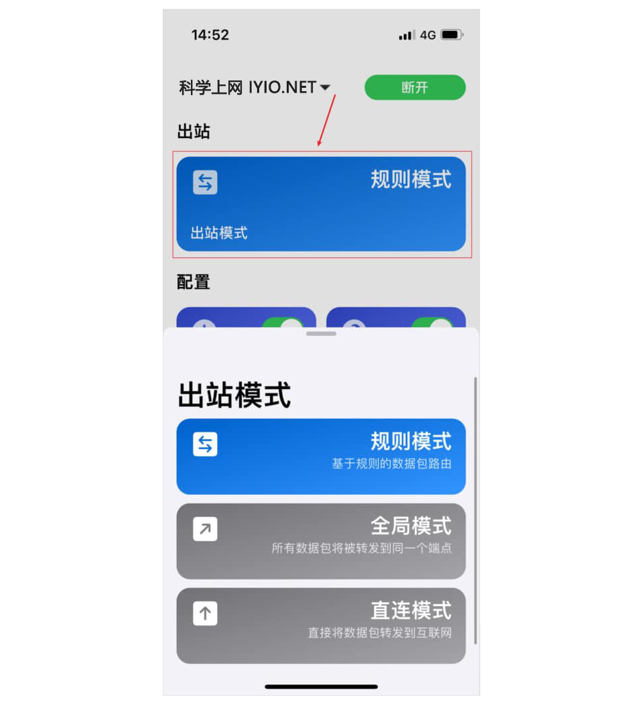
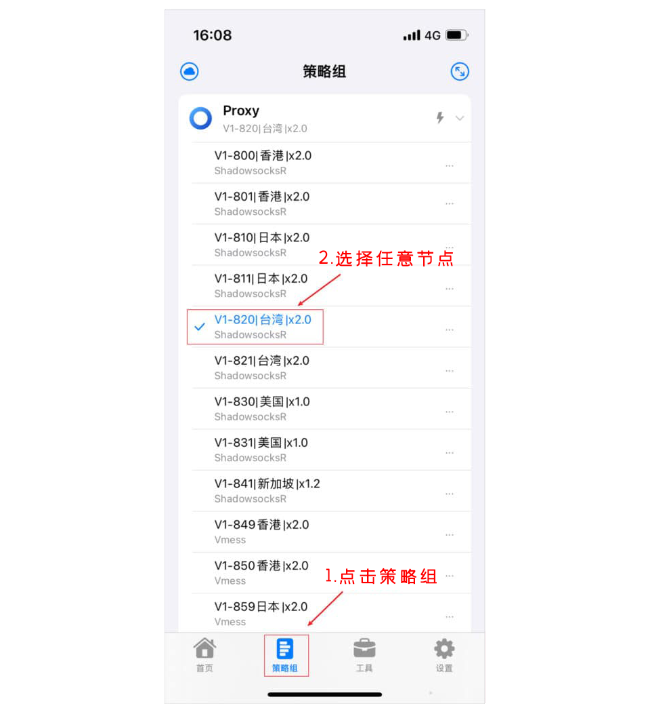

## Stash For iOS 下载地址及使用教程 科学上网客户端下载使用汇总

**Stash** 是一款 iOS/tvOS/macOS 平台基于规则的多协议代理客户端，完全兼容 Clash Premium 配置，支持 Rule Set 规则、按需连接、SSID Policy Group、MitM、HTTP 嗅探、JavaScript 脚本改写等丰富特性，是 Clash 规则在 iOS 平台的最佳选择。

**Stash** 可完美兼容Clash节点订阅地址，功能强大且支持多种代理协议，如 Direct、HTTP、Hysteria、Hysteria2、Shadowsocks (SS)、ShadowsocksR (SSR)、Snell、Socks5、Trojan、TUIC、V2Ray、WireGuard、Xray 等代理协议。

## 界面预览

*Stash 界面预览*

## Stash 下载

### 下载地址

由于App Store中国区禁止上架VPN类所有软件，所以该软件仅在美区、港区等非国区App Store可下载，并且该软件是收费软件，为开发者收取。自己注册外区 ID 详见[最新注册外区Apple ID教程](https://clashgithub.com/usa-apple-id.html)

打开手 **App Store** ->使用 **非国区 Apple ID** 登录，登录成功后 App Store 会切换对应的语言，在搜索框输入 **Stash** 进行安装

| 客户端    | 价格  | 版本号(App Store)               | 下载地址                                                     |
| --------- | ----- | ------------------------------- | ------------------------------------------------------------ |
| **Stash** | $3.99 |  | [**App Store** 下载](https://apps.apple.com/us/app/shadowrocket/id1596063349) |

更多优秀的代理上网客户端，查看[《Windows 、Android 、IOS、macOS 全平台科学上网工具 APP客户端下载汇总》](https://github.com/free-nodes/fanqiang)

## 准备订阅节点

节点即软件中的配置文件，在使用之前，首先需要添加一个 **Qv2ray 服务器节点**，即服务端才能使用代理上网功能，由于软件支持VMess、VLESS、Shadowsocks、Socks、Trojan等代理协议不同，根据软件不同选择对应协议的服务器节点。

如需免费节点可以使用本站[免费节点](https://github.com/free-nodes/v2rayfree)。免费节点资源少或者觉得免费节点不稳定的话可以考虑购买收费节点。收费节点一般都有多个数据中心及套餐可选。

#### 机场推荐：

- 【 [ORYMI（点击注册）](https://orymi.net/#/register?code=rDsEp8Hf)】 免费观看netflix、disney+、primevideo、hbomax 九折优惠码：LxwSsaay
- 【 [星辰加速（点击注册）](https://starlinkboost.com/#/register?code=9kfk8enH)】 150G/9元/月 免账号观看disney+ 九折优惠码：3UJuVnqS

如果对稳定性及隐私性要求高且有一定的要求，推荐自己搭建节点，速度有保证且安全性也最高，具体搭建教程可参考本站的节点[VPN搭建](https://github.com/free-nodes/vpn)相关教程。

## 配置文件

在使用之前，确认已经获得了节点订阅地址或者托管的配置文件，有三种方式可以导入配置文件，分别是**从 URL 下载**、**扫描 QRcode 下载**、**从文件导入**。

### 从 URL 下载

软件支持 **Stash 订阅链接**、**Clash 订阅链接**直接导入，目前最简单方便的就是从 URL 下载导入配置文件。

点击软件最底部【**设置**】选项卡进去设置页面，点击【**配置文件**】，在配置列表页面，点击【**从URL下载**】，接着直接在弹出的窗口中**输入节点订阅链接**即可如下图所示：

*从 URL 下载配置文件*

### 扫描 QRcode 下载

软件支持扫描二维码导入节点，在配置列表页面，点击【**扫描 QRcode 下载**】，如下图所示：

*扫描 QRcode 下载配置文件*

### 从文件导入

软件支持扫描二维码导入节点，在配置列表页面，点击【**扫描 QRcode 下载**】，如下图所示：

*从文件导入配置文件*

### 成功导入配置

在通过以上三种方法成功导入配置之后，可以在配置列表页面看到添加的配置文件，点击选择该配置文件，如下图所示：

*成功导入配置文件*

## 使用教程

### 启动代理

在成功添加导入配置文件并选择配置文件之后，点击软件主最底部【**首页**】选项卡，可以看到最左上角已启用刚刚添加的配置文件，直接点击右边的启动按钮即可【**启用**】代理，如下图所示：

*启动代理*

### 出站模式

在软件主最底部【**首页**】选项卡，可以在最顶部看到出站模式，默认为**规则模式**，在成功启动并连接代理服务器后，直接点击出站模式就可以进行切换，如下图所示：

*出站模式*

软件一共支持三种出站模式，分别是**规则模式**、**全局模式**、**直连模式**。

| **规则模式**： | 所有请求直接发往代理服务器           |
| -------------- | ------------------------------------ |
| **全局模式**： | 所有请求直接发往代理服务器           |
| **直连模式**： | 所有请求直接发往目的地，即不使用代理 |

全局模式可能会导致国内流量也走代理访问，除了网络会变慢外，还会消耗套餐流量。规则模式的好处就是区分国内国外的流量只有在规则内的国外网站才会走代理，这样即不影响国内访问速度，又节省套餐流量，所以如果没有什么特别的需求，一般选择 **规则模式** 即可。

### 切换代理

点击软件最底部菜单【**策略组**】选项卡，可以看到有很多节点，点击任意节点即可切换代理节点服务器，如下图所示：

*切换代理*

## 常见问题

Stash 支持哪些代理协议？

支持Direct、HTTP、Hysteria、Hysteria2、Shadowsocks (SS)、ShadowsocksR (SSR)、Snell、Socks5、Trojan、TUIC、V2Ray、WireGuard、Xray等代理协议。

