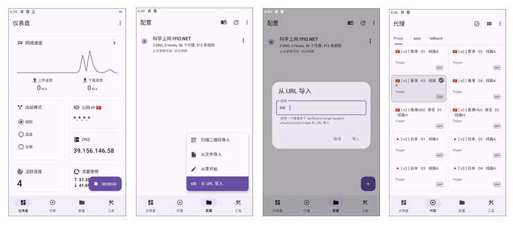
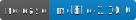
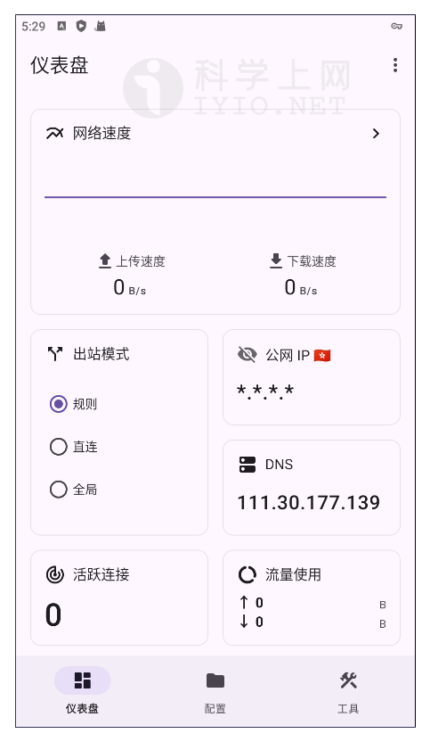
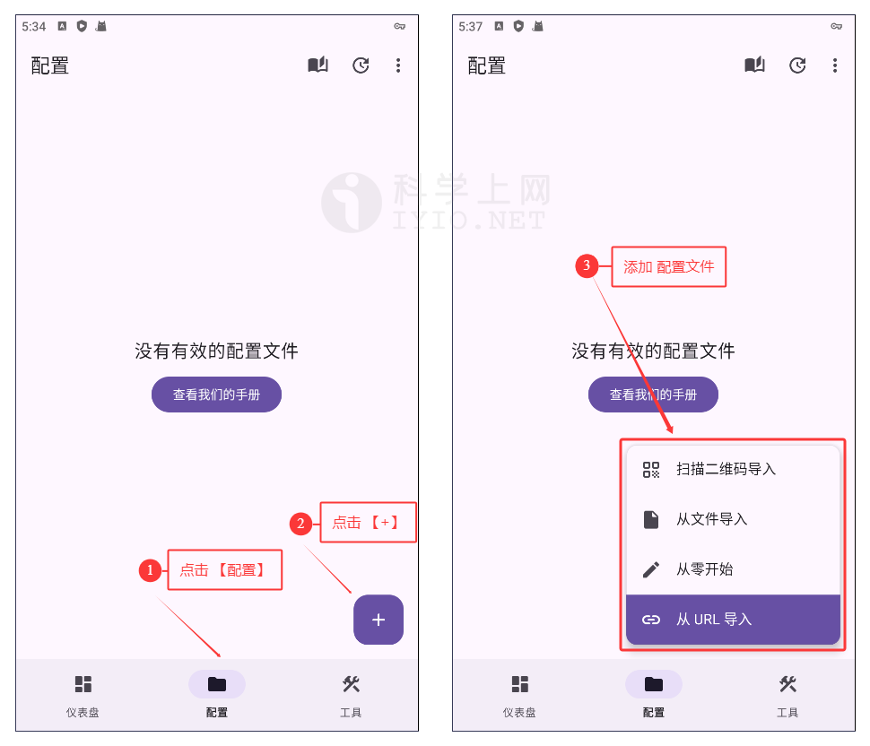
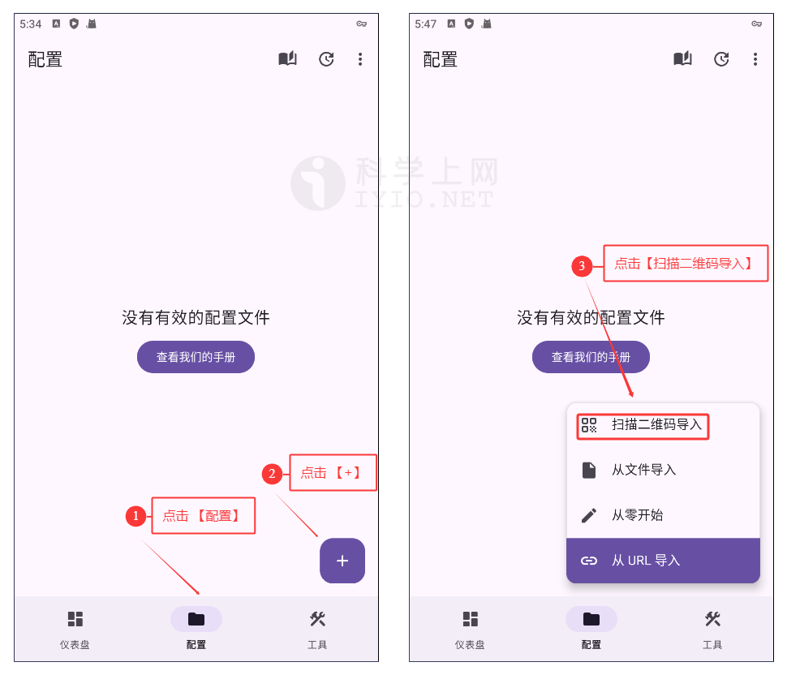
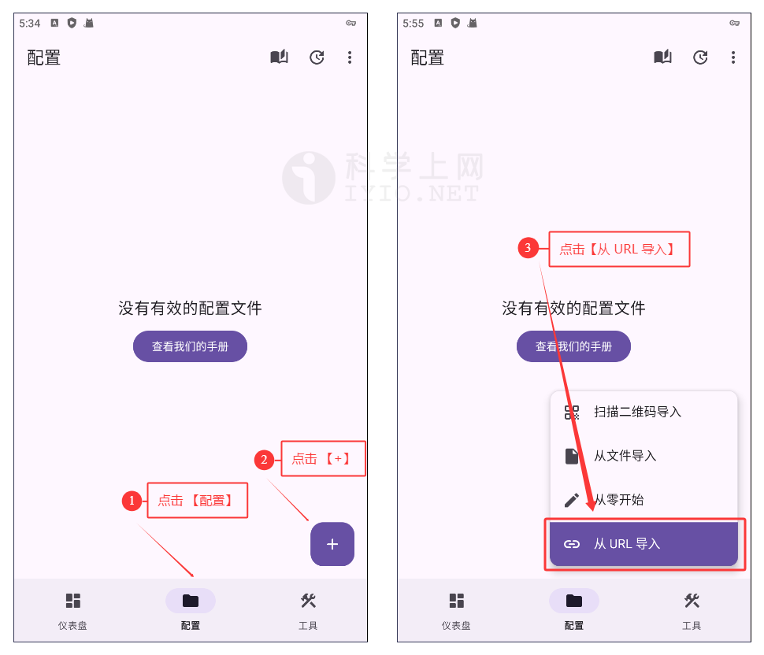
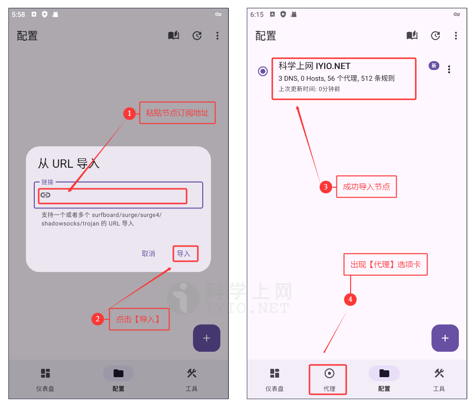
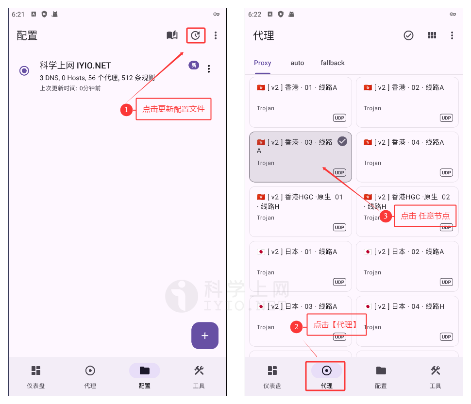
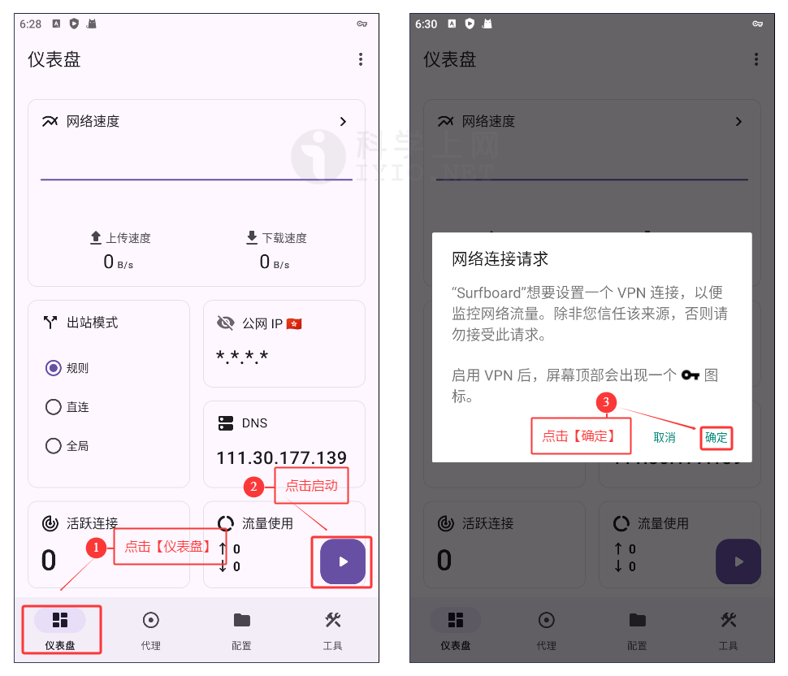
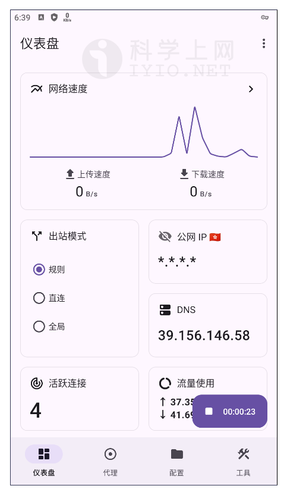

## Surfboard For Android 下载地址及使用教程 科学上网客户端下载使用汇总

**Surfboard** 是一款运行在 Android 系统上的网络代理软件客户端，同时兼容 [Suge](https://www.iyio.net/search?q=Surge) 配置，可以直接将 Surge 的标准配置文件导入使用，支持多种代理协议，如 Shadowsocks(SS)、V2Ray(VMess)、Trojan、HTTP、HTTPS、SOCK5、SOCKS5 over TLS 等代理协议。

## Surfboard 界面预览

*Surfboard 界面预览*

## Surfboard 下载地址

新手使用建议下载稳定版本，即版本号后标记为 `Latest` 的版本。

| 客户端        | 版本号(Latest)                 | 更新日期                                       | 下载地址                                                     |
| ------------- | ------------------------------ | ---------------------------------------------- | ------------------------------------------------------------ |
| **Surfboard** |  |  | [GitHub 下载](https://github.com/getsurfboard/surfboard/releases) |

更多优秀的代理上网客户端，查看[《Windows 、Android 、IOS、macOS 全平台科学上网工具 APP客户端下载汇总》](https://github.com/free-nodes/fanqiang)

## Surfboard 安装教程

安装教程很简单，如果是通过应用商店下载的，那么直接根据提示下载并安装即可，如果是通过官网下载或其他第三方下载的，下载完后获得文件为 `mobile-xx-release.apk` 文件，其中后缀 `.apk` 为安卓系统的安装包，`x.x.x` 代表软件平台，一般默认选择 `mobile-universal-release.apk` 通用版本，然后点击安装即可，十分简单。

安装完后，打开软件进入主界面，即仪表盘界面，如下图所示：

*Surfboard 仪表盘主界面*

## 准备订阅节点

节点即软件中的配置文件，在使用之前，首先需要添加一个 **Qv2ray 服务器节点**，即服务端才能使用代理上网功能，由于软件支持VMess、VLESS、Shadowsocks、Socks、Trojan等代理协议不同，根据软件不同选择对应协议的服务器节点。

如需免费节点可以使用本站[免费节点](https://github.com/free-nodes/v2rayfree)。免费节点资源少或者觉得免费节点不稳定的话可以考虑购买收费节点。收费节点一般都有多个数据中心及套餐可选。

#### 机场推荐：

- 【 [ORYMI（点击注册）](https://orymi.net/#/register?code=rDsEp8Hf)】 免费观看netflix、disney+、primevideo、hbomax 九折优惠码：LxwSsaay
- 【 [星辰加速（点击注册）](https://starlinkboost.com/#/register?code=9kfk8enH)】 150G/9元/月 免账号观看disney+ 九折优惠码：3UJuVnqS

如果对稳定性及隐私性要求高且有一定的要求，推荐自己搭建节点，速度有保证且安全性也最高，具体搭建教程可参考本站的节点[VPN搭建](https://github.com/free-nodes/vpn)相关教程。

## 添加配置文件

点击软件主界面底部配置选项卡，如下图所示一共有四种添加方式，分别是**扫描二维码导入**、**从文件导入**、**从零开始**、**从URL导入**，一般选择**从URL导入**即可。

*添加配置文件*

### 扫描二维码导入

首先从电脑打开服务器节点的二维码图片或者把二维码图片保存至手机，点击软件底部【**配置**】选项卡，点击【➕】号，然后选择【**扫描二维码导入**】，扫描电脑屏幕上的二维码或选择从手机相册打开二维码图片扫描配置文件二维码即可导入节点信息，如下图所示：

*扫描二维码导入*

### 从文件导入

点击软件底部【**配置**】选项卡，点击【➕】号，然后选择【**从文件导入**】。

### 从零开始

点击软件底部【**配置**】选项卡，点击【➕】号，然后选择【**从零开始**】，从零开始为代码模式，不建议。

### 从URL导入【推荐】

点击软件底部【**配置**】选项卡，点击【➕】号，然后选择【**从 URL 导入**】，如下图所示：

*从URL导入*

远程订阅地址即通过 URL 链接导入，一般的服务商都会直接提供节点地址，直接复制服务商提供的节点订阅地址即可，如下图所示：

*复制订阅地址*

随后在弹出的窗口中输入**节点订阅地址**，并点击【**导入**】，导入成功后，软件主界面底部会出现【**代理**】选项卡，如下图所示：

*从URL导入节点订阅地址*

成功导入节点订阅地址之后，点击【**配置**】选项卡，点击软件右上角的按钮如下图所示**更新节点订阅地址**，然后点击【**代理**】选项卡，选择任意节点即可，如下图所示：

*选择代理节点*

至此通过URL导入节点成功，也是一般大部分机场推荐的方式。

## 使用教程

### 启动代理

点击软件主界面底部【**仪表盘**】选显卡，可以看到右下角出现了一个**播放按钮**，点击播放按钮即可启动代理，如下图所示：

*选择代理节点*

成功启动代理之后，仪表盘软件右下角的图标会变成计时器，即代表启动成功。

## 常见问题

Surfboard支持哪些协议？

支持Shadowsocks(SS)、V2Ray(VMess)、Trojan、HTTP、HTTPS、SOCK5、SOCKS5 over TLS等代理协议。

