## v2rayNG For Android 下载地址及使用教程 科学上网客户端下载使用汇总

**v2rayNG** 是 Android 系统即安卓手机系统下的代理软件客户端，功能强大且支持多种代理协议，如VMess、VLESS、Shadowsocks、Socks、Trojan、Hysteria等代理协议。通过本文2025最新V2RayNG for Android 使用教程，能快速方便配置代理协议进行代理访问。

## v2rayNG 界面预览

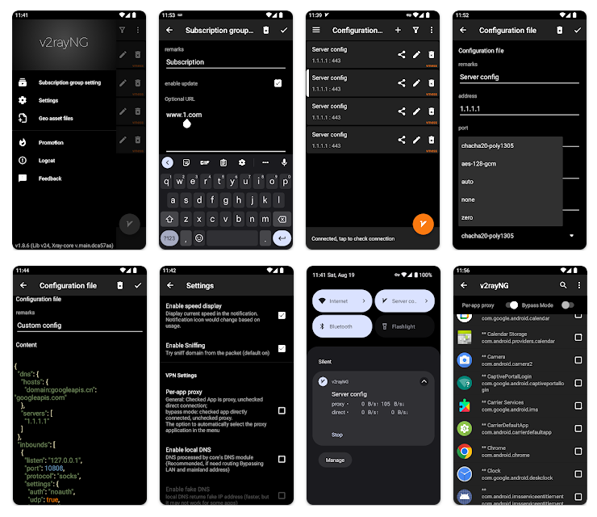*v2rayNG 界面预览*

## v2rayNG 官网下载

### 下载地址

新手使用建议下载稳定版本，即版本号后标记为 `Latest` 的版本。

| 客户端      | 版本号(Latest)               | 更新日期                                     | 下载地址                                                     |
| ----------- | ---------------------------- | -------------------------------------------- | ------------------------------------------------------------ |
| **v2rayNG** |  |  | [GitHub 下载](https://github.com/2dust/v2rayNG/releases) / [Google Play](https://play.google.com/store/apps/details?id=com.v2ray.ang) |

更多优秀的代理上网客户端，查看[《Windows 、Android 、IOS、macOS 全平台科学上网工具 APP客户端下载汇总》](https://github.com/free-nodes/fanqiang)

### 版本选择

在官网下载地址中，有众多版本可供下载，如下表所示，其中文件名当中的数字为版本号，版本号之后跟着的是平台名称及包名称。

| 文件名                         | 说明                                      |
| ------------------------------ | ----------------------------------------- |
| v2rayNG_1.9.33_arm64-v8a.apk   | 安卓 Android 系统 8代64位 ARM 处理器      |
| v2rayNG_1.9.33_armeabi-v7a.apk | 安卓 Android 系统 7代及以上3位 ARM 处理器 |
| v2rayNG_1.9.33_universal.apk   | 安卓 Android 系统 通用                    |
| v2rayNG_1.9.33_x86.apk         | 安卓 Android 系统 x86架构                 |
| v2rayNG_1.9.33_x86_64.apk      | 安卓 Android 系统 x86_64架构              |
| Source code (zip)              | 源文件压缩包 zip 版本                     |
| Source code (tar.gz)           | 源文件压缩包 tar.gz 版本                  |

## v2rayNG 安装教程

安装教程很简单，如果是通过应用商店下载的，那么直接根据提示下载并安装即可，如果是通过官网下载或其他第三方下载的，下载完后获得文件为 `v2rayNG_x.x.x.apk` 文件，其中后缀 `.apk` 为安卓系统的安装包，`x.x.x` 代表版本号，然后点击安装即可，十分简单。

安装完后，打开软件进入主界面，即配置文件界面，如下图所示。

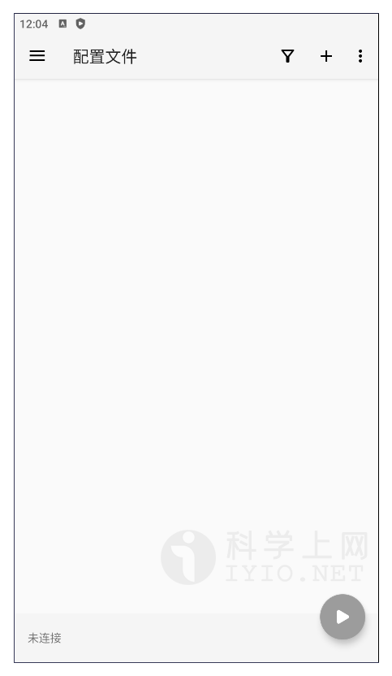*v2rayNG 主界面*

## 准备订阅节点

节点即软件中的配置文件，在使用之前，首先需要添加一个 **Qv2ray 服务器节点**，即服务端才能使用代理上网功能，由于软件支持VMess、VLESS、Shadowsocks、Socks、Trojan等代理协议不同，根据软件不同选择对应协议的服务器节点。

如需免费节点可以使用本站[免费节点](https://github.com/free-nodes/v2rayfree)。免费节点资源少或者觉得免费节点不稳定的话可以考虑购买收费节点。收费节点一般都有多个数据中心及套餐可选。

#### 机场推荐：

- 【 [ORYMI（点击注册）](https://orymi.net/#/register?code=rDsEp8Hf)】 免费观看netflix、disney+、primevideo、hbomax 九折优惠码：LxwSsaay
- 【 [星辰加速（点击注册）](https://starlinkboost.com/#/register?code=9kfk8enH)】 150G/9元/月 免账号观看disney+ 九折优惠码：3UJuVnqS

如果对稳定性及隐私性要求高且有一定的要求，推荐自己搭建节点，速度有保证且安全性也最高，具体搭建教程可参考本站的节点[VPN搭建](https://github.com/free-nodes/vpn)相关教程。

## v2rayNG 使用教程

### 添加配置文件

获得节点服务器信息后，就可以开始添加配置文件了，点击软件主界面右上角的 【➕】 号按钮即可出现添加配置文件选项，如下图 V2rayNG 主界面所示，根据不同的节点添加不同的节点服务器配置文件。

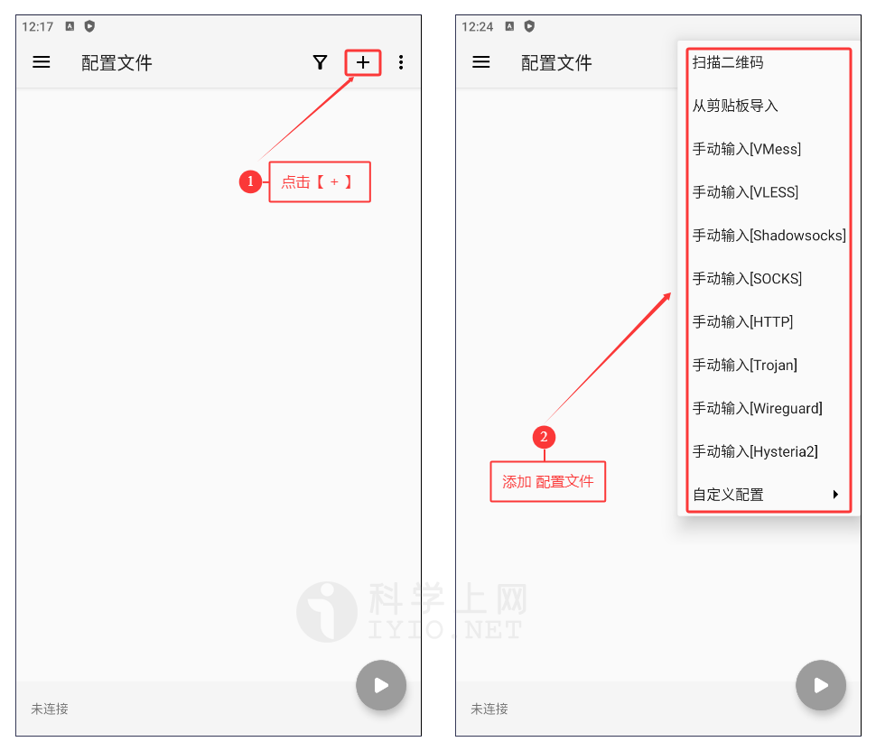*添加配置文件*

### 扫描二维码

首先从电脑打开服务器节点的二维码图片或者把二维码图片保存至手机，然后点击软件主界面右上角的 【➕】 号按钮即可出现添加配置文件选项，选择【**扫描二维码**】，扫描电脑屏幕上的二维码或选择从手机相册打开二维码图片扫描配置文件二维码即可导入节点信息，如下图所示。

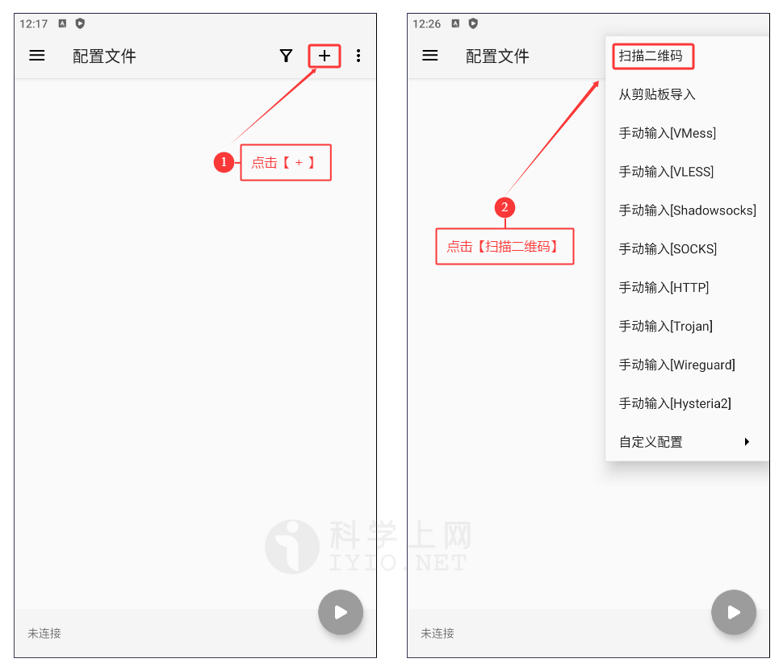*添加配置文件扫描二维码*

### 从剪贴板导入

首先复制节点服务器的连接地址，不同协议的地址如下所示。

| `vmess://`  | VMESS服务器即v2Ray节点地址 |
| ----------- | -------------------------- |
| `vless://`  | VLESS服务器即Xray节点地址  |
| `ss://`     | Shadowsock服务器节点地址   |
| `socks5://` | Socks服务器节点地址        |
| `trojan://` | Trojan服务器节点地址       |

注意一定要复制全。

然后点击软件主界面右上角的 【➕】 号按钮即可出现添加配置文件选项，选择【**从剪贴板导入**】配置文件即可，如下图所示。

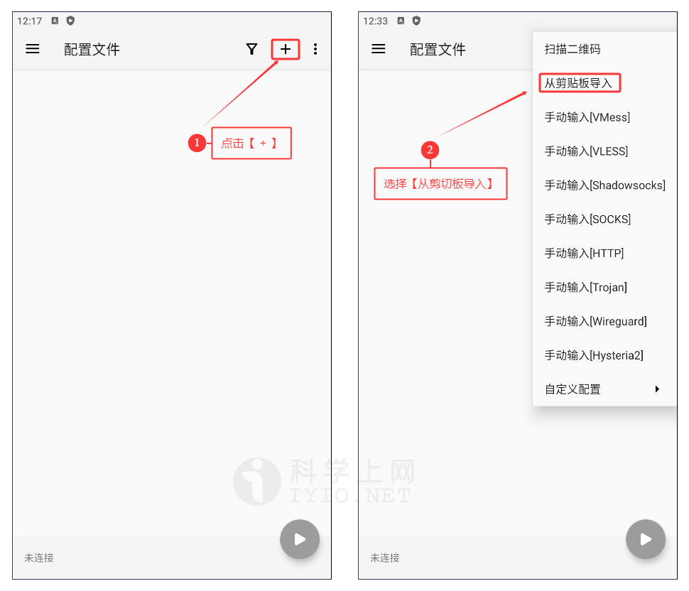*添加配置文件从剪贴板导入*

### 手动输入[Vmess]

配置V2Ray节点，通过点击软件主界面右上角的 【➕】 号按钮即可出现添加配置文件选项，选择【**手动输入[Vmess]**】即可，如下图所示。

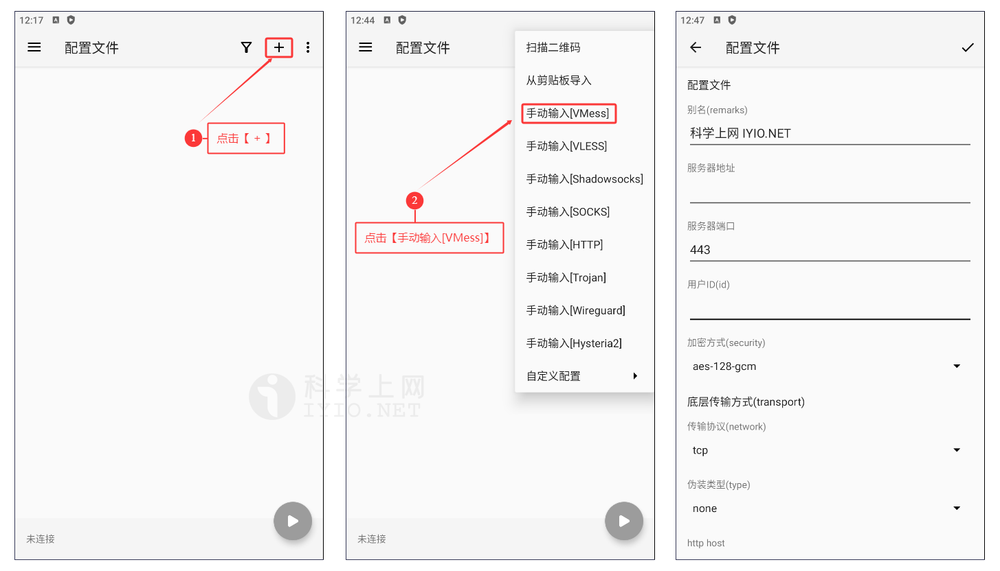*添加配置文件V2Ray节点Vmess信息*

在弹出的窗口中手动输入 V2Ray 节点信息，即可配置 V2Ray 服务器信息，然后点击右上角的 【✔】 按钮，即可添加 V2Ray 代理服务器。

其他Shadowsocks、Socks、Trojan、Wireguard、Hysteria..等设置方式基本相似。

### 订阅地址方式

远程订阅地址即通过 URL 链接导入，一般的服务商都会直接提供节点地址，直接复制服务商提供的节点订阅地址即可，如下图所示：

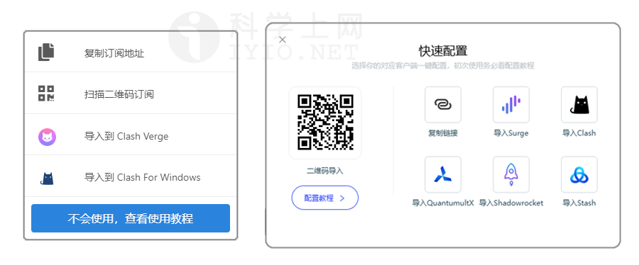

软件支持直接使用机场订阅链接来添加节点信息，如下图所示点击软件主界面左上角 **三道杠** 按钮，在弹出窗口进入系统设置界面，然后点击【**订阅设置**】，如下图所示。

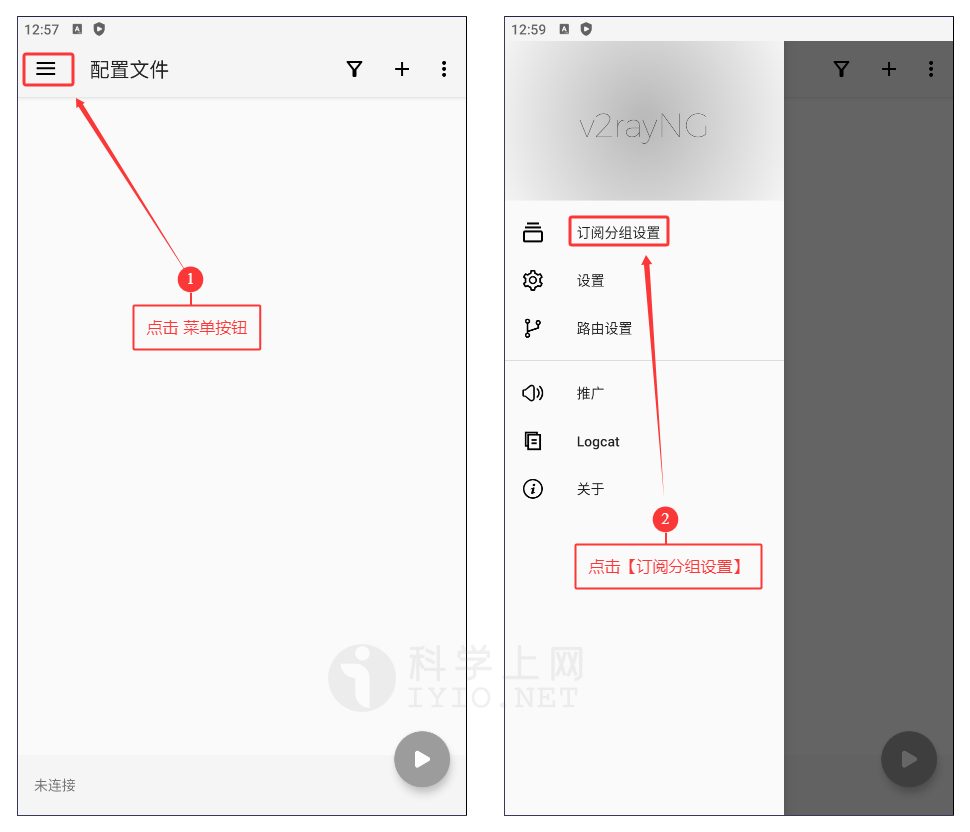*系统设置界面订阅分组设置*

在弹出的订阅设置主界面，点击右上角的 【➕】 号按钮即可出现**添加订阅界面**，在[**备注**]处输入自己能区分这个订阅节点的内容，然后在[**可选地址(url)**]处输入订阅地址，最后点击右上角的 【✔】 按钮，即可添加订阅地址，如下图所示。

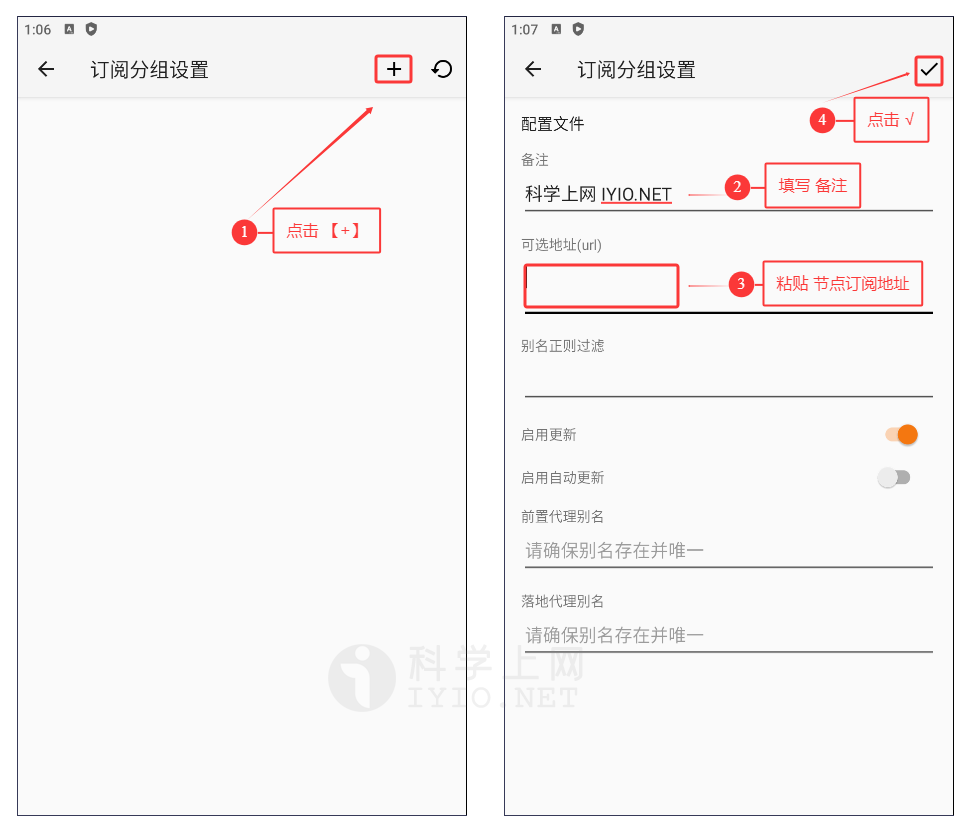*订阅分组设置添加订阅配置文件*

最后也是最重要的一步，返回到软件主界面，然后点击最右上角的 **三束点** 按钮，在弹出界面选择【**更新订阅**】，如下图所示。

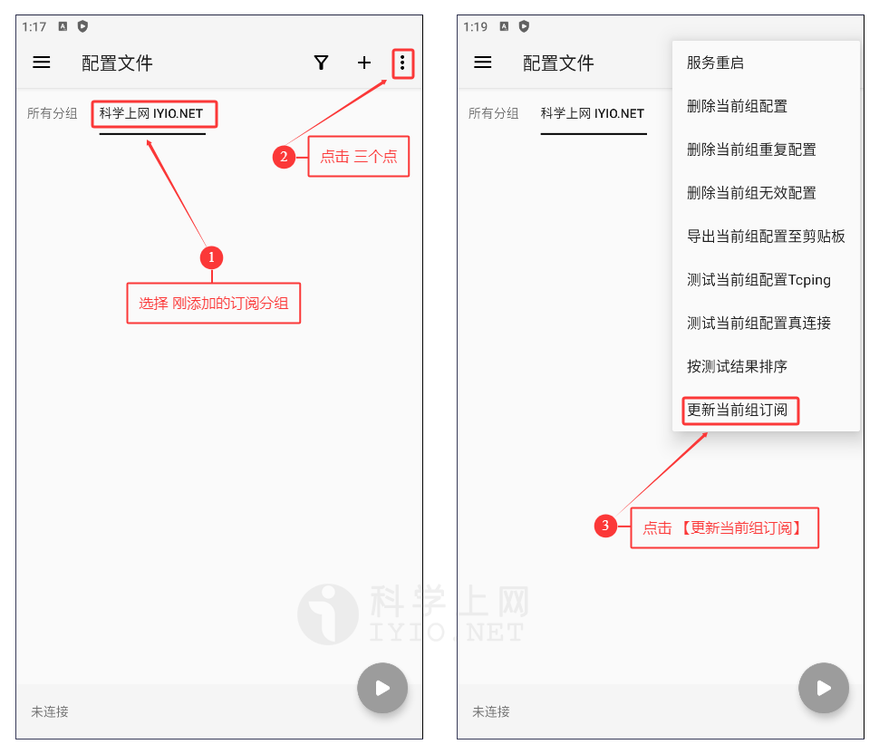*订阅分组设置添加订阅配置文件*

至此，通过订阅地址方式添加代理服务器就成功了，如果是通过订阅地址添加的节点服务器，会在当前节点的列表右上角显示刚才添加订阅设置时候输入的备注，如下图所示。

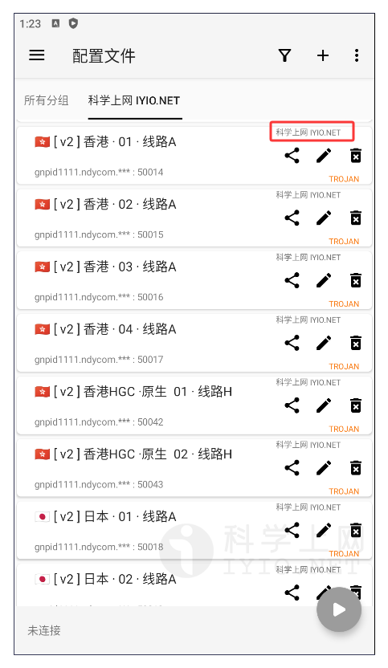*订阅设置更新订阅成功*

### 代理服务器

在软件的主界面中可以看到自己通过手动添加或者订阅设置添加的所有代理服务器列表，其中每一条代理服务器最右边的竖条代表选定服务器的状态，**黑色**代表选中，如下图所示。

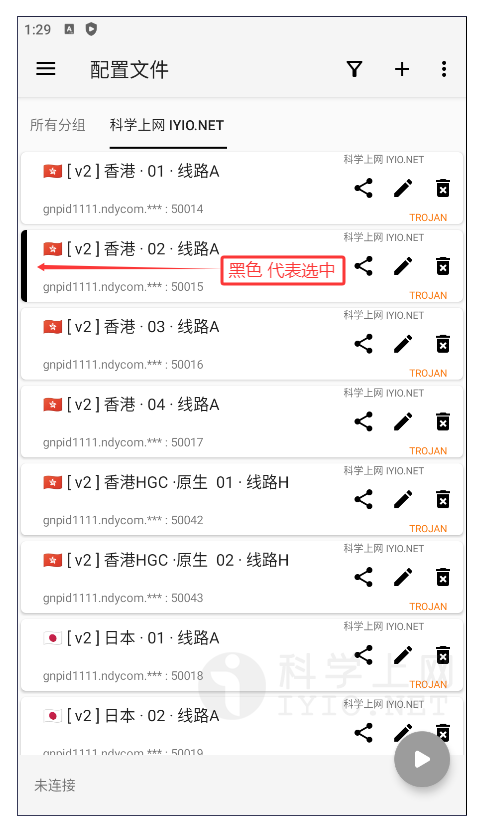*配置文件状态*

每一条代理服务器的操作都可以在这里进行，右边三个图标分别代表**分享**节点服务器、**编辑**节点服务器、**删除**节服务器，如下图所示。

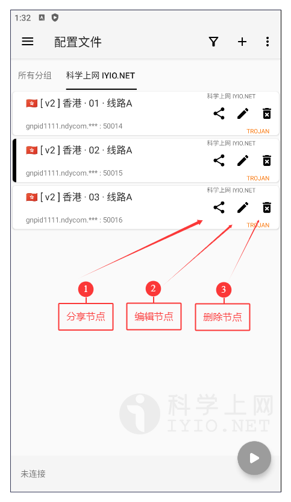*配置文件操作*

### 启动代理服务器

点击软件主界面右小角的 **V** 字图标启动代理，首次配置会提示是否创建代理，即软件界面中的网络链接请求，点击【允许】启动。

启动成功后，主界面右下角的软件图标会变色代表启动成功。

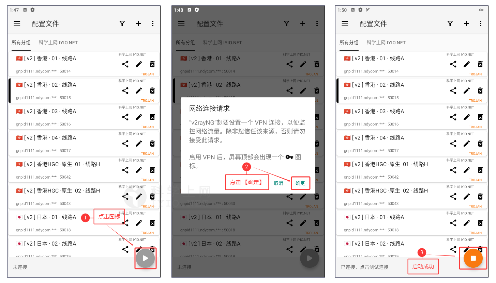*启动代理服务器*

#### 切换代理服务器

在有多条代理服务器的时候，只需要直接点击想要链接的那条代理服务器，即可切换代理服务器，无论是未链接状态还是已链接状态，都可以进行切换。

#### 分享代理服务器

可点击[**分享节点**]服务器图标，可直接生成二维码进行分享，也可以[**导出当前节点至剪切板**]，然后通过上面的从剪贴板操作导入节点服务器。

#### 编辑代理服务器

编辑代理服务器和添加代理服务器原理一样。

#### 删除代理服务器

点击删除节点服务器图标，即可删除代理服务器。

### 路由设置

路由设置的原理是将入站数据按需求由不同的出站链接发出，从而达到按需代理的目的。这一功能的常见用法的分流国内外流量，可以通过内部机制判断不同地区的流量，然后将他们发送到不同的出站代理，在v2rayNG中，有三种路由配置可以设置，分别是域名策略、自定义规则、预定义规则。

#### 域名策略

在域名策略中，系统一共内置了三种域名策略可以选择。

- Asls
- IPIfNonMatch
- IPOnDemand

根据不同的需求选择合适的域名策略，一般默认即可。

#### 自定义规则

在自定义规则中，可通过自定义来设置需要代理的网址或IP、直连的网址或IP、阻止的网址或IP，从而达到个性化的代理需求。

#### 预定义规则

新手推荐使用这个，在预定义规则中，系统已经内置好了不同的路由规则。

- 全局代理
- 绕过局域网地址而后代理
- 绕过大陆地址而后代理
- 绕过局域网及大陆地址而后代理
- 全局直连

根据不同的需求选择合适的预定义规则，一般选择[**绕过局域网及大陆地址而后代理**]。

## 常见问题

支持哪些协议？

VMess、VLESS、Trojan、Socks、Shadowsocks、Hysteria2、Tuic、WireGuard等代理协议。

如何分应用使用代理？

在设置→VPN设置→分应用代理，可以自行添加黑白名单。

与 v2rayN 的关系？

v2rayNG Windows版名为 v2rayN，可移步至 v2rayN 下载并查看详细教程。

