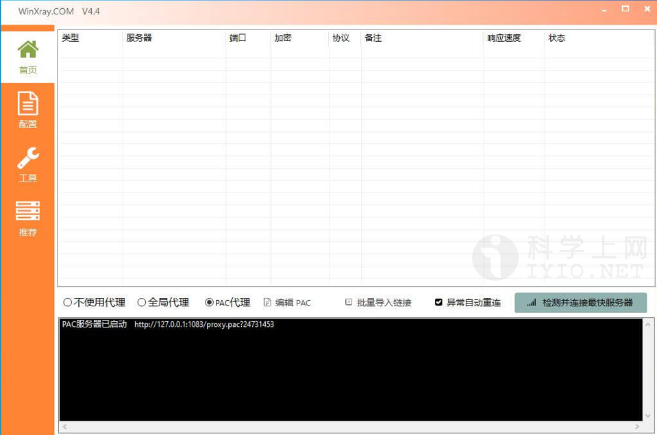
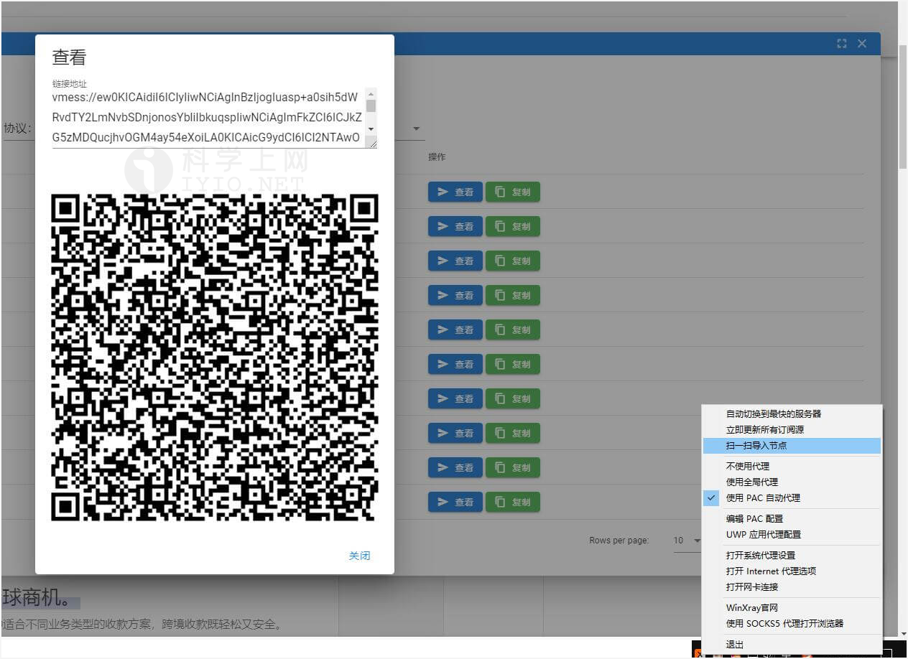
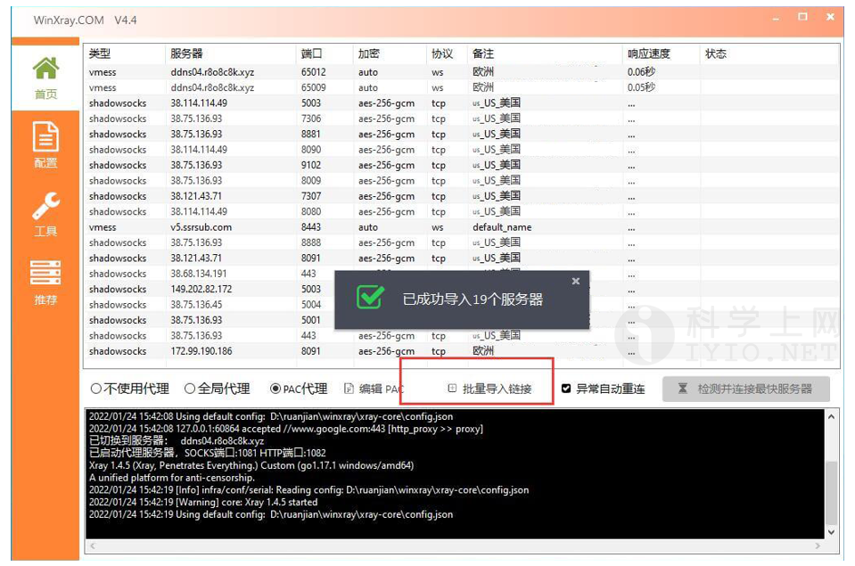
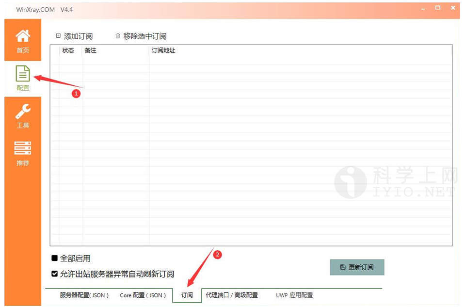
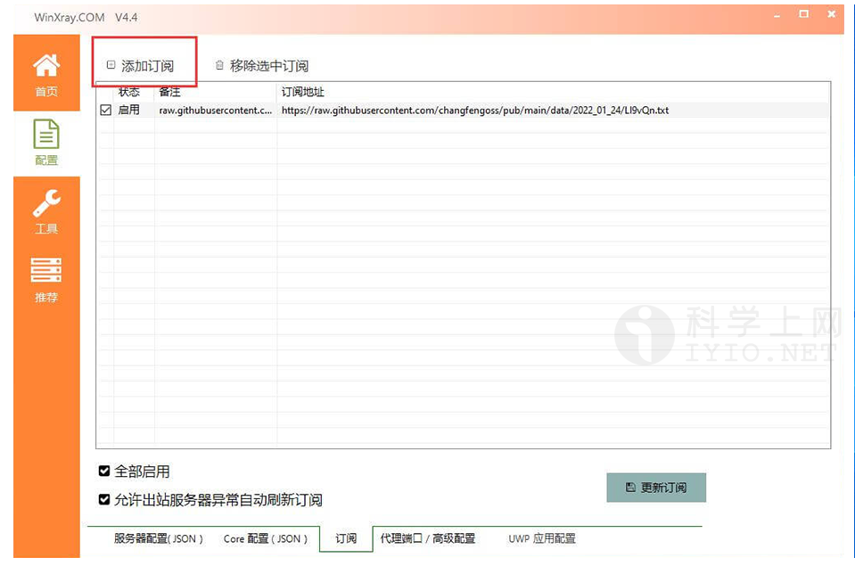
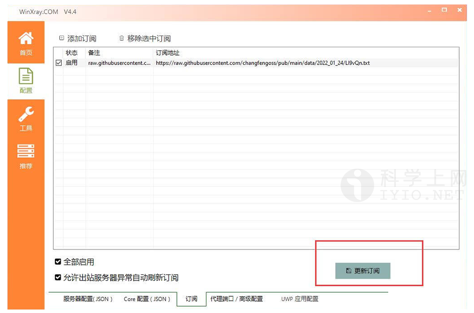
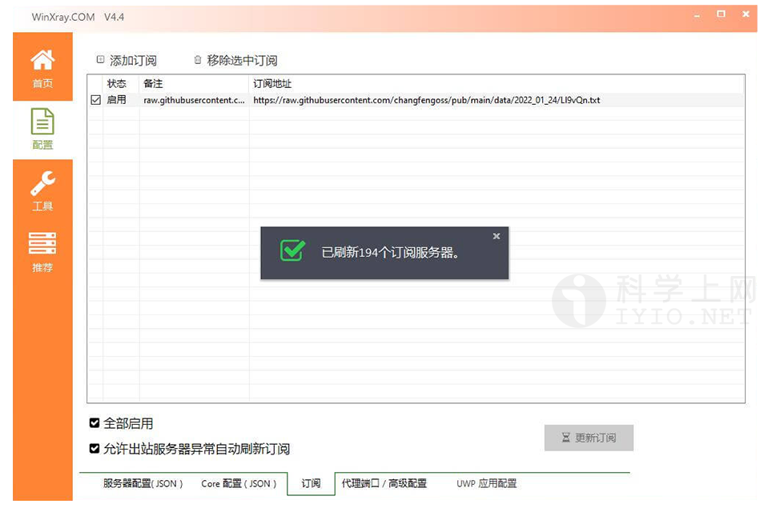
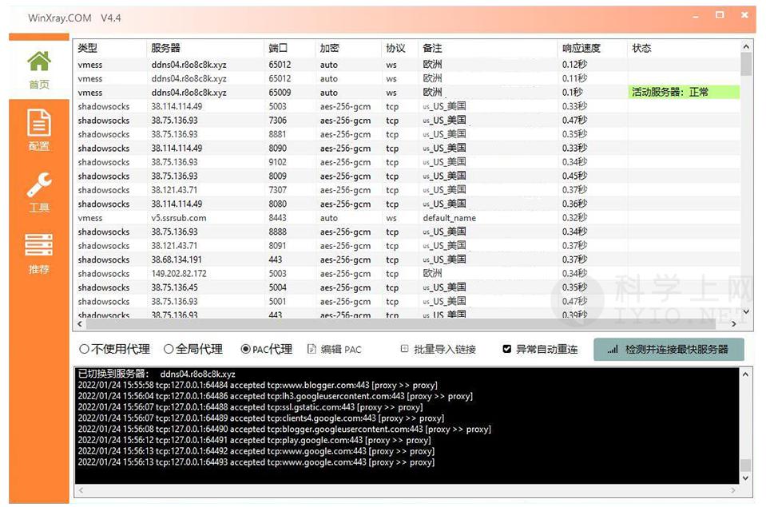

## WinXray for Windows 下载地址及使用教程 科学上网客户端下载使用汇总

**WinXray** 是 Windows 系统上简洁稳定的Xray/V2Ray、Shadowsocks、Trojan 通用客户端，支持：Xray（vmess / vless），Shadowsocks，Trojan，Trojan-go，SSR，NaiveProxy网络代理协议！默认基于Xray核心！可自动检测并连接访问速度最快的代理服务器。winXray可在服务器连接异常时自动更换代理服务器。

## WinXray 界面预览

*WinXray 主界面预览*

## WinXray 官网下载

新手使用建议下载稳定版本，即版本号后标记为 `Latest` 的版本。

### 下载地址

| 客户端      | 版本号(Latest)               | 更新日期                                     | 下载地址                                                   |
| ----------- | ---------------------------- | -------------------------------------------- | ---------------------------------------------------------- |
| **WinXray** |  |  | [GitHub 下载](https://github.com/TheMRLL/WinXray/releases) |

更多优秀的代理上网客户端，查看[《Windows 、Android 、IOS、macOS 全平台科学上网工具 APP客户端下载汇总》](https://github.com/free-nodes/fanqiang)

## WinXray 安装教程

### 软件安装

WinXray 下载完成是[**WinXray.7z**]的压缩包，无需安装，找到合适的目录直接解压，推荐安装在非系统盘，解压压缩包，解压后运行[**WinXray.exe**]即可使用。

## 准备订阅节点

节点即软件中的配置文件，在使用之前，首先需要添加一个 **Qv2ray 服务器节点**，即服务端才能使用代理上网功能，由于软件支持VMess、VLESS、Shadowsocks、Socks、Trojan等代理协议不同，根据软件不同选择对应协议的服务器节点。

如需免费节点可以使用本站[免费节点](https://github.com/free-nodes/v2rayfree)。免费节点资源少或者觉得免费节点不稳定的话可以考虑购买收费节点。收费节点一般都有多个数据中心及套餐可选。

#### 机场推荐：

- 【 [ORYMI（点击注册）](https://orymi.net/#/register?code=rDsEp8Hf)】 免费观看netflix、disney+、primevideo、hbomax 九折优惠码：LxwSsaay
- 【 [星辰加速（点击注册）](https://starlinkboost.com/#/register?code=9kfk8enH)】 150G/9元/月 免账号观看disney+ 九折优惠码：3UJuVnqS

如果对稳定性及隐私性要求高且有一定的要求，推荐自己搭建节点，速度有保证且安全性也最高，具体搭建教程可参考本站的节点[VPN搭建](https://github.com/free-nodes/vpn)相关教程。

## WinXray 使用教程

### 导入节点

导入节点的方法有四种

#### 手动添加

手动添加就不介绍了，就是把参数一个个的写入到配置里面，这个不推荐，容易出错，也慢，尤其是节点比较多的时候。

#### 扫描屏幕二维码

顾名思义，就是在你电脑上打开一个二维码图片时，找到电脑桌面右下角的 **winxray** 图标，鼠标右击winxray图标 -> 【**扫一扫导入节点**】 就可以导入节点了。

*扫描屏幕二维码*

#### 从粘贴板导入

当你已经复制好节点链接后，在 winxray 客户端下方点击批量导入链接便可以导入链接了。

*从粘贴板导入*

#### 导入订阅链接

远程订阅地址即通过 URL 链接导入，一般的服务商都会直接提供节点地址，直接复制服务商提供的节点订阅地址即可，如下图所示：

*复制订阅地址*

订阅的话，就是订阅一个链接，这个链接包含有批量的节点，订阅服务器上的节点有变化时，在客户端只需要更新订阅，那么客户端的节点也会跟着变化。下面说一下操作步骤。

winxray客户端中，点击配置 -> 订阅

*从粘贴板导入*

然后复制好订阅服务器的链接，点击 添加订阅，会自动导入订阅服务器的链接。

*添加订阅*

最后点击winXray客户端右下角的 更新订阅，如果链接有效的话，可以看到客户端多了很多节点。

*更新订阅*

*更新订阅*

#### 启动节点

winXay客户端是自动检测节点的响应速度，并自动连接到速度最快的节点，如果节点挂掉，会再次自动检测并连接最快服务器。

*启动节点*

## 总结:

**优点:**

1. 支持VMESS、VLESS、SS、trojan等多种协议；
2. 支持导入节点，使用方便；.
3. 智能切换最快服务器。

**缺点:**

1. 启动切换节点响应微慢；
2. 新增节点手动配置难度大；
3. 仅支持Windows平台，无法在Mac上使用。

winXray 是一款操作简单，容易上手的 xray 客户端，免安装，打开导入节点直接使用，可以说没有任何门槛。跟着这个步骤来一定可以学会。如果没有节点，可以使用我更新的免费节点，每天更新，可以流畅播放4K视频。